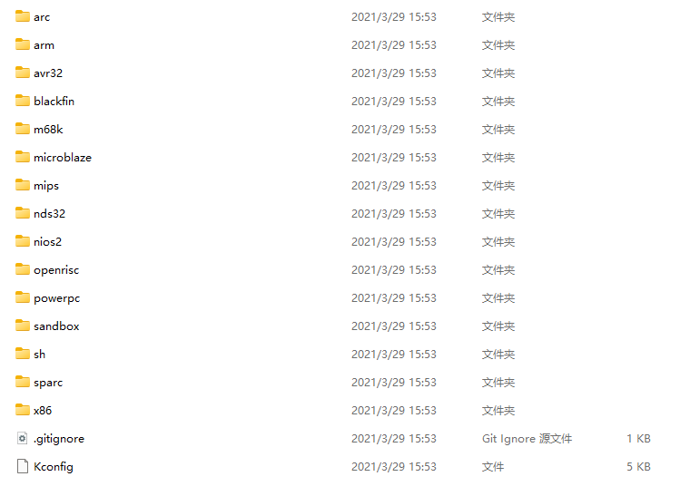
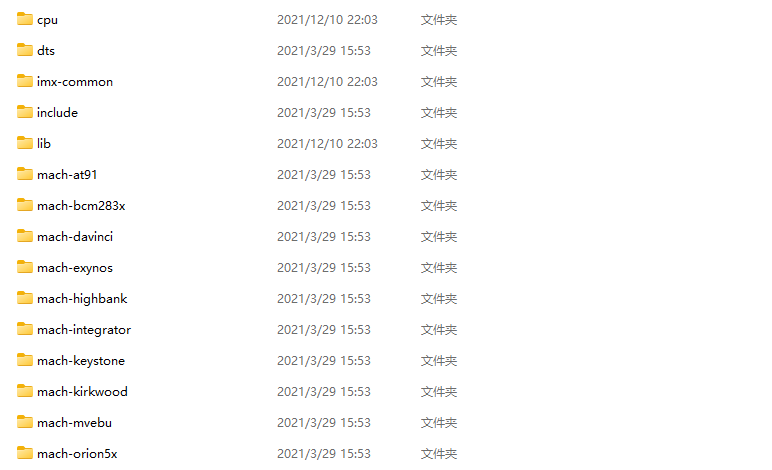
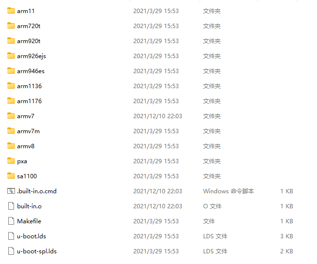
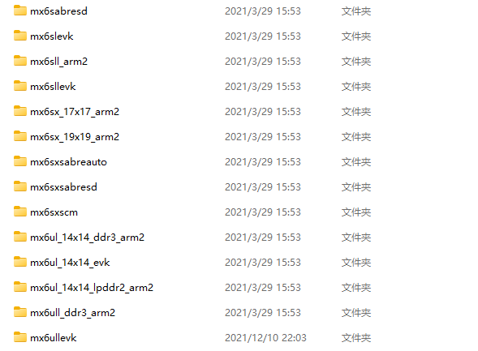
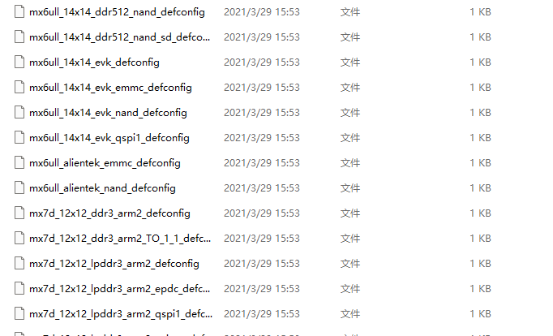
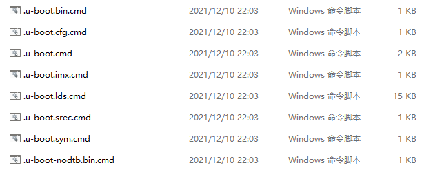

# **Uboot目录结构**

## (一) 顶层目录结构

### 1.目录说明

| 目录名称 | 目录说明                               |
| -------- | -------------------------------------- |
| api      | 与硬件无关的API函数                    |
| board    | 开发板定制代码                         |
| arch     | 与架构相关的代码                       |
| cmd      | 命令相关的代码                         |
| common   | 独立于处理器体系结构的通用代码         |
| configs  | 配置文件                               |
| disk     | 磁盘分区相关代码                       |
| doc      | Uboot说明文档                          |
| drivers  | 通用驱动代码                           |
| dts      | 设备树                                 |
| examples | 示例代码                               |
| fs       | 文件系统相关代码                       |
| include  | 头文件                                 |
| lib      | 库文件                                 |
| Licenses | 许可证相关文件                         |
| net      | 网络相关的文件目录如nfs、tftp          |
| post     | 上电自检文件                           |
| scripts  | 脚本文件                               |
| test     | 测试代码                               |
| tools    | 创建U-Boot S-RECORD和BIN镜像文件的工具 |

### 2.文件说明

| 文件名称        | 文件说明                                |
| --------------- | --------------------------------------- |
| .config         | 编译后生成的配置文件                    |
| .gitignore      | git工具忽略文件                         |
| .mailmap        | 邮件列表                                |
| .u-boot.xxx.cmd | 编译后生成的用于保存命令                |
| config.mk       | Makefile子文件                          |
| Kbuild          | 用于生成一些和汇编有关的文件            |
| Kconfig         | 图形化界面配置文件                      |
| MAINTAINERS     | 维护者信息                              |
| Makefile        | 主Makefile                              |
| README          | 使用前阅读文件                          |
| System.map      | 系统映射文件                            |
| u-boot          | 编译出来的u-boot文件                    |
| u-boot.xxx      | u-boot中间文件(其中u-boot.imx为imx专用) |

## (二) 目录详细说明

### 1.arch文件夹



如上图所示，`arch`目录下存放着许多和架构相关的文件，如`arm`、`avr32`、`m68k`等等。



这里分析以ARM芯片为例，打开`arm`文件夹如上图所示，mach开头的文件夹和具体的设备有关，比如`mach-exynos`就是和三星的**exynos**系列CPU有关的文件；`imx-common`文件夹就是和imx系列有关的文件。这里`cpu`文件夹就是和cpu架构有关的代码，打开如下所示:



该目录下有许多ARM架构相关的文件，imx6ull使用的就是Cortex-A7内核，所以在`armv7`文件夹下。`u-boot.lds`是ARM芯片使用的链接脚本。

### 2.board文件夹


`board`文件夹里面存放的是和板子有关的代码，打开文件夹里面都是各种芯片厂商的目录，例如`samsung`是三星的，`freescale`文件夹是飞思卡尔的。



这里主要分析`freescale`文件夹，I.MX系列芯片以前属于freescale，后来freescale被NXP收购了。打开`freescale`文件夹，如上图所示，里面有许多NXP官方开发板的文件。

### 3.configs文件夹



如图所示，`configs`文件夹里面保存的文件都是uboot的配置文件。uboot可以通过配置文件进行配置，一般半导体厂商或者开发板厂商会制作好有关配置文件，这些配置文件统一命名为`xxx_defconfig`，xxx表示开发板的名称，我们可以在这些配置文件上添加自己想要的功能。在编译前使用`make xxx_defconfig`就可以使用这些配置文件了。

### 4.u-boot.xxx_cmd文件



如图所示，`.u-boot.xxx_cmd`文件是一系列的文件，这些文件都是编译后生成的命令文件，例如`.u-boot.bin.cmd`文件内容如下:

```makefile
cmd_u-boot.bin := cp u-boot-nodtb.bin u-boot.bin
```

这里面定义了一个变量来保存一条copy命令，也就是将`u-boot-nodtb.bin`拷贝后重命名为`u-boot.bin`文件。而`u-boot-nodtb.bin`文件又是由`.u-boot-nodtb.bin.cmd`文件生成，该文件内容如下:

```makefile
cmd_u-boot-nodtb.bin := /tools/gcc-linaro-7.5.0-2019.12-x86_64_arm-linux-gnueabihf/bin/arm-linux-gnueabihf-objcopy --gap-fill=0xff  -j .text -j .secure_text -j .rodata -j .hash -j .data -j .got -j .got.plt -j .u_boot_list -j .rel.dyn -O binary  u-boot u-boot-nodtb.bin
```

这里使用了**arm-linux-gnueabihf-objcopy**将ELF格式的`u-boot`文件转换成二进制的u`u-boot-nodtb.bin`文件`.u-boot.cmd`文件用于生成`u-boot`文件，内容如下:

```makefile
cmd_u-boot := /tools/gcc-linaro-7.5.0-2019.12-x86_64_arm-linux-gnueabihf/bin/arm-linux-gnueabihf-ld.bfd   -pie  --gc-sections -Bstatic -Ttext 0x87800000 -o u-boot -T u-boot.lds arch/arm/cpu/armv7/start.o --start-group  arch/arm/cpu/built-in.o  arch/arm/cpu/armv7/built-in.o  arch/arm/imx-common/built-in.o  arch/arm/lib/built-in.o  board/freescale/common/built-in.o  board/freescale/mx6ullevk/built-in.o  cmd/built-in.o  common/built-in.o  disk/built-in.o  drivers/built-in.o  drivers/dma/built-in.o  drivers/gpio/built-in.o  drivers/i2c/built-in.o  drivers/mmc/built-in.o  drivers/mtd/built-in.o  drivers/mtd/onenand/built-in.o  drivers/mtd/spi/built-in.o  drivers/net/built-in.o  drivers/net/phy/built-in.o  drivers/pci/built-in.o  drivers/power/built-in.o  drivers/power/battery/built-in.o  drivers/power/fuel_gauge/built-in.o  drivers/power/mfd/built-in.o  drivers/power/pmic/built-in.o  drivers/power/regulator/built-in.o  drivers/serial/built-in.o  drivers/spi/built-in.o  drivers/usb/dwc3/built-in.o  drivers/usb/emul/built-in.o  drivers/usb/eth/built-in.o  drivers/usb/gadget/built-in.o  drivers/usb/gadget/udc/built-in.o  drivers/usb/host/built-in.o  drivers/usb/musb-new/built-in.o  drivers/usb/musb/built-in.o  drivers/usb/phy/built-in.o  drivers/usb/ulpi/built-in.o  fs/built-in.o  lib/built-in.o  net/built-in.o  test/built-in.o  test/dm/built-in.o --end-group arch/arm/lib/eabi_compat.o  -L /tools/gcc-linaro-7.5.0-2019.12-x86_64_arm-linux-gnueabihf/bin/../lib/gcc/arm-linux-gnueabihf/7.5.0 -lgcc -Map u-boot.map
```

`.u-boot.cmd`中使用了**arm-linux-gnueabihf-ld.bfd**工具，也就是链接工具，将各个`built-in.o`文件链接起来形成`u-boot`文件。uboot在编译时会将同一个目录中所有文件编译在一起，并命名为`built-in.o`。如果使用NXP的I.MX芯片，此时需要向开发板烧写的就是`u-boot.imx`文件，而不是`u-boot.bin`文件，前者是在后者的头部加上了IVT、DCD等信息，这个工作由`.u-boot.imx.cmd`完成，其内容如下:

```makefile
cmd_u-boot.imx := ./tools/mkimage -n board/freescale/mx6ullevk/imximage.cfg.cfgtmp -T imximage -e 0x87800000 -d u-boot.bin u-boot.imx  >/dev/null
```

可以看出这样使用到了`tools/mkimage`工具，而IVT、DCD等信息保存在了文件`board/freescale/mx6ullevk/imximage.cfg.cfgtmp`中。`u-boot.lds.cmd`文件就是用于生成`u-boot.lds`链接脚本的。由于该文件比较长，这里就以省略的方式列出来部分，内容如下所示，这里可以看出`u-boot.lds`的源文件是`arch/arm/cpu/u-boot.lds`。

```makefile
cmd_u-boot.lds := /tools/gcc-linaro-7.5.0-2019.12-x86_64_arm-linux-gnueabihf/bin/arm-linux-gnueabihf-gcc -E -Wp,-MD,./.u-boot.lds.d -D__KERNEL__ -D__UBOOT__   -D__ARM__ -marm -mno-thumb-interwork  -mabi=aapcs-linux  -mword-relocations  -fno-pic  -mno-unaligned-access  -ffunction-sections -fdata-sections -fno-common -ffixed-r9  -msoft-float  -pipe  -march=armv7-a   -Iinclude   -I./arch/arm/include -include ./include/linux/kconfig.h  -nostdinc -isystem /tools/gcc-linaro-7.5.0-2019.12-x86_64_arm-linux-gnueabihf/bin/../lib/gcc/arm-linux-gnueabihf/7.5.0/include -include ./include/u-boot/u-boot.lds.h -DCPUDIR=arch/arm/cpu/armv7  -ansi -D__ASSEMBLY__ -x assembler-with-cpp -P -o u-boot.lds arch/arm/cpu/u-boot.lds

source_u-boot.lds := arch/arm/cpu/u-boot.lds

deps_u-boot.lds := \
    $(wildcard include/config/armv7/secure/base.h) \
    $(wildcard include/config/armv7/nonsec.h) \
    …………
    $(wildcard include/config/image/format/legacy.h) \
    $(wildcard include/config/disable/image/legacy.h) \

u-boot.lds: $(deps_u-boot.lds)

$(deps_u-boot.lds):
```

### 5.Makefile文件