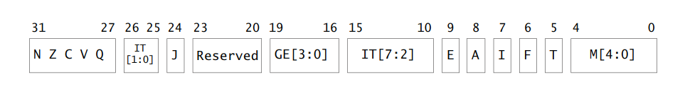

# UBoot启动流程

## 1.链接脚本

要分析uboot的启动流程首先要分析uboot的链接脚本，对于arm系列的芯片，链接脚本路径为`arch/arm/cpu/uboot.lds`，最终uboot所使用的链接脚本就是在这个文件基础上生成的。首先需要编译运行uboot，编译后会在根目录下生成`uboot.lds`文件，内容如下所示：

```
OUTPUT_FORMAT("elf32-littlearm", "elf32-littlearm", "elf32-littlearm")
OUTPUT_ARCH(arm)
ENTRY(_start)
SECTIONS
{
 . = 0x00000000;
 . = ALIGN(4);
 .text :
 {
  *(.__image_copy_start)
  *(.vectors)
  arch/arm/cpu/armv7/start.o (.text*)
  *(.text*)
 }
 . = ALIGN(4);
 .rodata : { *(SORT_BY_ALIGNMENT(SORT_BY_NAME(.rodata*))) }
 . = ALIGN(4);
 .data : {
  *(.data*)
 }
 . = ALIGN(4);
 . = .;
 . = ALIGN(4);
 .u_boot_list : {
  KEEP(*(SORT(.u_boot_list*)));
 }
 . = ALIGN(4);
 .image_copy_end :
 {
  *(.__image_copy_end)
 }
 .rel_dyn_start :
 {
  *(.__rel_dyn_start)
 }
 .rel.dyn : {
  *(.rel*)
 }
 .rel_dyn_end :
 {
  *(.__rel_dyn_end)
 }
 .end :
 {
  *(.__end)
 }
 _image_binary_end = .;
 . = ALIGN(4096);
 .mmutable : {
  *(.mmutable)
 }
 .bss_start __rel_dyn_start (OVERLAY) : {
  KEEP(*(.__bss_start));
  __bss_base = .;
 }
 .bss __bss_base (OVERLAY) : {
  *(.bss*)
   . = ALIGN(4);
   __bss_limit = .;
 }
 .bss_end __bss_limit (OVERLAY) : {
  KEEP(*(.__bss_end));
 }
 .dynsym _image_binary_end : { *(.dynsym) }
 .dynbss : { *(.dynbss) }
 .dynstr : { *(.dynstr*) }
 .dynamic : { *(.dynamic*) }
 .plt : { *(.plt*) }
 .interp : { *(.interp*) }
 .gnu.hash : { *(.gnu.hash) }
 .gnu : { *(.gnu*) }
 .ARM.exidx : { *(.ARM.exidx*) }
 .gnu.linkonce.armexidx : { *(.gnu.linkonce.armexidx.*) }
}
```

`ENTRY(_start)`表示当前入口为`__start`，这个函数在`arch/arm/lib/vector.S`文件中有定义。在编译后，打开根目录下的`uboot.map`文件，这个文件是uboot的映射文件，找到`__image_copy_start`，内容如下所示：

```lds
Memory Configuration

Name             Origin             Length             Attributes
*default*        0x0000000000000000 0xffffffffffffffff

Linker script and memory map

Address of section .text set to 0x87800000
                0x0000000000000000                . = 0x0
                0x0000000000000000                . = ALIGN (0x4)

.text           0x0000000087800000    0x3f03c
 *(.__image_copy_start)
 .__image_copy_start
                0x0000000087800000        0x0 arch/arm/lib/built-in.o
                0x0000000087800000                __image_copy_start
 *(.vectors)
 .vectors       0x0000000087800000      0x2e8 arch/arm/lib/built-in.o
                0x0000000087800000                _start
                0x0000000087800020                _undefined_instruction
                0x0000000087800024                _software_interrupt
                0x0000000087800028                _prefetch_abort
                0x000000008780002c                _data_abort
                0x0000000087800030                _not_used
                0x0000000087800034                _irq
                0x0000000087800038                _fiq
                0x0000000087800040                IRQ_STACK_START_IN
 arch/arm/cpu/armv7/start.o(.text*)
 .text          0x00000000878002e8       0xb0 arch/arm/cpu/armv7/start.o
                0x00000000878002e8                reset
                0x00000000878002ec                save_boot_params_ret
                0x0000000087800328                c_runtime_cpu_setup
                0x0000000087800338                save_boot_params
                0x000000008780033c                cpu_init_cp15
                0x0000000087800390                cpu_init_crit
 *(.text*)
 .text          0x0000000087800398       0x24 arch/arm/cpu/armv7/built-in.o
                0x0000000087800398                lowlevel_init
                ......
```

如上所示代码中，`.__iamge_copy_start`所指向的文件是`arch/arm/lib/built-in.o`，我们进入该目录下用`grep`命令搜索`__image_copy_start`，结果如下：

```
./relocate.S:   ldr     r1, =__image_copy_start /* r1 <- SRC &__image_copy_start */
./relocate_64.S:        ldr     x1, =__image_copy_start /* x1 <- SRC &__image_copy_start */
./sections.c:char __image_copy_start[0] __attribute__((section(".__image_copy_start")));
```

其中`sections.c`中有如下定义：

```c
char __bss_start[0] __attribute__((section(".__bss_start")));
char __bss_end[0] __attribute__((section(".__bss_end")));
char __image_copy_start[0] __attribute__((section(".__image_copy_start")));
char __image_copy_end[0] __attribute__((section(".__image_copy_end")));
char __rel_dyn_start[0] __attribute__((section(".__rel_dyn_start")));
char __rel_dyn_end[0] __attribute__((section(".__rel_dyn_end")));
char __secure_start[0] __attribute__((section(".__secure_start")));
char __secure_end[0] __attribute__((section(".__secure_end")));
char _end[0] __attribute__((section(".__end")));
```

`attribute`为GNU C中用于声明一个函数、变量或类型的特殊关键字，主要用于指导编译器在编译程序时进行特点方面的优化或代码检查，例如`aligned`来声明对齐等等。我们知道在源代码编译生成可执行文件的过程中函数和变量是放在不同段的，全局未初始化的变量是放在`bss`段的，通过`int val __attribute__((section(".data")))`可以来指定将这个变量放到`.data`段。所以`__attribute__((section(".__image_copy_start")))`的意思就是将`__image_copy_start[0]`放到链接脚本中的`.__iamge_copy_start`段了，并且数组长度为零，不占内存。通过分析链接脚本文件可以得知，`__image_copy_start`在链接脚本中位置在`.text`段的前面，而`__iamge_copy_end`在`.data`段的后面。也就是说这两个地址分别表示uboot要拷贝的起始地址和结束地址。

```
/*
 * void relocate_code(addr_moni)
 *
 * This function relocates the monitor code.
 *
 * NOTE:
 * To prevent the code below from containing references with an R_ARM_ABS32
 * relocation record type, we never refer to linker-defined symbols directly.
 * Instead, we declare literals which contain their relative location with
 * respect to relocate_code, and at run time, add relocate_code back to them.
 */

ENTRY(relocate_code)
	ldr	r1, =__image_copy_start	/* r1 <- SRC &__image_copy_start */
	subs	r4, r0, r1		/* r4 <- relocation offset */
	beq	relocate_done		/* skip relocation */
	ldr	r2, =__image_copy_end	/* r2 <- SRC &__image_copy_end */

copy_loop:
	ldmia	r1!, {r10-r11}		/* copy from source address [r1]    */
	stmia	r0!, {r10-r11}		/* copy to   target address [r0]    */
	cmp	r1, r2			/* until source end address [r2]    */
	blo	copy_loop
```

我们再打开`relocate.S`文件，内容如上所示，`r1`寄存器保存拷贝的起始地址，`r2`寄存器保存拷贝的结束地址，`r4`寄存器保存偏移地址，然后`copy_loop`函数进行来拷贝。再回到链映射文件中，可以看出`__image_copy_start`和`__start`的地址都是`0x0000000087800000 `，也说明了前面`__image_copy_start[0]`不占位置。`.vectors`段也是在`arch/arm/lib/built-in.o`中，在同级目录下找到`vectors.S`文件，部分内容如下：

```c
.globl _start

/*
 *************************************************************************
 *
 * Vectors have their own section so linker script can map them easily
 *
 *************************************************************************
 */

	.section ".vectors", "ax"

/*
 *************************************************************************
 *
 * Exception vectors as described in ARM reference manuals
 *
 * Uses indirect branch to allow reaching handlers anywhere in memory.
 *
 *************************************************************************
 */

_start:

#ifdef CONFIG_SYS_DV_NOR_BOOT_CFG
	.word	CONFIG_SYS_DV_NOR_BOOT_CFG
#endif

	b	reset
	ldr	pc, _undefined_instruction
	ldr	pc, _software_interrupt
	ldr	pc, _prefetch_abort
	ldr	pc, _data_abort
	ldr	pc, _not_used
	ldr	pc, _irq
	ldr	pc, _fiq
```

其中`.section ".vectors", "ax"`表示下面的代码会被编译进`.vectors`段中，`ax`为`allocation execute`，表示该节区可分配且可执行。我们再对应到`uboot.map`文件中，`.vectors`段映射的就是`_start`、`IRQ_STACK_START_IN`以及异常中断向量表，而`start.o`则被映射到`.text`段了，这里后面详细分析。

| 符号               | 地址       | 描述                 |
| ------------------ | ---------- | -------------------- |
| __image_copy_start | 0x87800000 | uboot拷贝首地址      |
| __image_copy_end   | 0x8785dd54 | uboot 拷贝的结束地址 |
| __rel_dyn_start    | 0x8785dd54 | .rel.dyn 段起始地址  |
| __rel_dyn_end      | 0x878668f4 | .rel.dyn 段结束地址  |
| _image_binary_end  | 0x878668f4 | 镜像结束地址         |
| __bss_start        | 0x8785dd54 | .bss 段起始地址      |
| __bss_end          | 0x878a8e74 | .bss 段结束地址      |

如上所示是链接脚本中一些符号的值，可以从`uboot.map`中查到，这里的地址并不是一定是这些值，代码的变动、编译优化等级等都会影响到这些值。

## 2.reset函数

从上述分析中可以得知入口是`arch/arm/lib/vectors.S`文件中的`_start`，代码如下所示：

```
_start:

#ifdef CONFIG_SYS_DV_NOR_BOOT_CFG
	.word	CONFIG_SYS_DV_NOR_BOOT_CFG
#endif

	b	reset
	ldr	pc, _undefined_instruction
	ldr	pc, _software_interrupt
	ldr	pc, _prefetch_abort
	ldr	pc, _data_abort
	ldr	pc, _not_used
	ldr	pc, _irq
	ldr	pc, _fiq

/*
 *************************************************************************
 *
 * Indirect vectors table
 *
 * Symbols referenced here must be defined somewhere else
 *
 *************************************************************************
 */

	.globl	_undefined_instruction
	.globl	_software_interrupt
	.globl	_prefetch_abort
	.globl	_data_abort
	.globl	_not_used
	.globl	_irq
	.globl	_fiq

_undefined_instruction:	.word undefined_instruction
_software_interrupt:	.word software_interrupt
_prefetch_abort:	.word prefetch_abort		
_data_abort:		.word data_abort
_not_used:		.word not_used
_irq:			.word irq
_fiq:			.word fiq

	.balignl 16,0xdeadbeef
```

`b reset`的意思是跳转到`reset`函数中，`reset`函数在`arch/arm/armv7/start.S`里面。剩下后面的部分表示中断向量表，这里补充一点`.balignl 16,0xdeadbeef`表示以当前的地址开始，到后面第一个能被16整除的地址中间填充`0xdeadbeef`，也就是十六字节对齐，这里也可以对照`uboot.map`文件，可以看出`_fiq`到后空了8个字节，而函数只占4个字节。进入`start.S`文件中，`reset`函数内容如下：

```

	.globl	reset
	.globl	save_boot_params_ret

reset:
	/* Allow the board to save important registers */
	b	save_boot_params
```

在`reset`函数中只有一句跳转指令，在文件中搜索`save_boot_params`，该函数定义如下：

```
/*************************************************************************
 *
 * void save_boot_params(u32 r0, u32 r1, u32 r2, u32 r3)
 *	__attribute__((weak));
 *
 * Stack pointer is not yet initialized at this moment
 * Don't save anything to stack even if compiled with -O0
 *
 *************************************************************************/
ENTRY(save_boot_params)
	b	save_boot_params_ret		@ back to my caller
ENDPROC(save_boot_params)
	.weak	save_boot_params
```

这里有几个宏定义，根据头文件引用我们可以在``include/linux/linkage.h`中找到，最终展开如下所示

```
.globl save_boot_params;   					@声明全局变量
.align		4;								@4字节对齐
save_boot_params:			
	b	save_boot_params_ret				@ 跳转到save_boot_params_ret函数
.type save_boot_params STT_FUNC;			@ 声明save_boot_params是一个函数
.size save_boot_params, .-save_boot_params	@ 声明函数大小为当前位置减去save_boot_params全局标号的位置(.表示当前位置)
.weak	save_boot_params					@ 弱标号，表示如果其他地方声明了这个函数就跳转到其他地方去
```

从上面可以知道`save_boot_params`会跳转到`save_boot_params_ret`函数中去，该函数定义在`reset`下面，内容如下：

```
save_boot_params_ret:
	/*
	 * disable interrupts (FIQ and IRQ), also set the cpu to SVC32 mode,
	 * except if in HYP mode already
	 */
	mrs	r0, cpsr			@ 读取cpsr寄存器内容到r0
	and	r1, r0, #0x1f		@ r0中获取低5位写入r1中
	teq	r1, #0x1a			@ 判断r1是否与0x1a相等(这里1a位11010,也就是HYP模式)
	bicne	r0, r0, #0x1f	@ 如果不等于的话清除低5位
	orrne	r0, r0, #0x13	@ 然后或上0x13(也就是只要不是HYP模式，就都进入SVC模式)
	orr	r0, r0, #0xc0		@ 将第六七位设置位1，禁用FRQ和IRQ
	msr	cpsr,r0				@ 最后写入cpsr中 (1101 0011)
```

这里需要参考`ARMV7`的编程手册的CPSR寄存器部分：



这里主要设置了第7位禁用IRQ，第6位禁用FRQ，以及第4到0位设置处理器运行于SVC模式。补充一点，在启动过程中，中断环境并没有完全准备好，一旦有中断产生，可能会导致预想不到的结果，比如程序跑飞，因此这里需要关闭IRQ和FRQ。

```
/*
 * Setup vector:
 * (OMAP4 spl TEXT_BASE is not 32 byte aligned.
 * Continue to use ROM code vector only in OMAP4 spl)
 */
#if !(defined(CONFIG_OMAP44XX) && defined(CONFIG_SPL_BUILD))
	/* Set V=0 in CP15 SCTLR register - for VBAR to point to vector */
	mrc	p15, 0, r0, c1, c0, 0	@ Read CP15 SCTLR Register // 选择异常向量表的基址
	bic	r0, #CR_V		@ V = 0
	mcr	p15, 0, r0, c1, c0, 0	@ Write CP15 SCTLR Register 

	/* Set vector address in CP15 VBAR register */
	ldr	r0, =_start
	mcr	p15, 0, r0, c12, c0, 0	@Set VBAR // 设置_start地址到VBAR
#endif

	/* the mask ROM code should have PLL and others stable */
#ifndef CONFIG_SKIP_LOWLEVEL_INIT
	bl	cpu_init_cp15
	bl	cpu_init_crit
#endif

	bl	_main
```

然后就是对CP15协处理器进行配置了。这里补充一点，CP寄存器除了CP15以外还有CP0到CP14，其中CP14用于DBUG调试，CP13和CP12保留，CP11用于双精度浮点计算，CP10用于单精度浮点计算，CP9和CP8保留，CP7到CP0留给生产厂家使用。在特权模式下，CP15协处理器读写方式如图所示：


接下来分析代码，首先会判断是不是使用了OMAR44的芯片，并且定义了`CONFIG_SPL_BUILD`，如果都满足的话就不会走这里(SPL即`Secondary Program Loader`，第二阶段程序加载器，对于有些SOC来说，他的内部SRAM比较小，无法装载整个uboot镜像，那么就需要SPL来负责初始化RAM和环境，并加载真正的uboot在外部RAM中来执行)，通过查询手册可以知道`mrc p15, 0, r0, c1, c0, 0`访问的是`SCTLR`寄存器，这个寄存器只能`PL1`或更高的权限才可以访问。将这个寄存器的值读取到`r0`寄存器中后，对第13位进行了清零操作(这个宏定义在`arch/arm/include/asm/system.h`中，值位`(1<<13)`)。


第13位表示选择异常中断向量表的基地址，选择0后可以设置偏移的地址，默认的地址是`0x00000000`。接下来将`_start`的地址写入`r0`，再将`r0`中的地址写入`VBAR`寄存器，当发生异常时就偏移到该寄存器中指定的地址执行。设置完异常中断向量表的基地址后，就进入`cpu_init_cp15`函数，对cpu初始化，并将`cpu_init_cp15`函数出来后执行的地址保存到`lr`寄存器中。该函数代码如下所示：

```
/*************************************************************************
 *
 * cpu_init_cp15
 *
 * Setup CP15 registers (cache, MMU, TLBs). The I-cache is turned on unless
 * CONFIG_SYS_ICACHE_OFF is defined.
 *
 *************************************************************************/
ENTRY(cpu_init_cp15)
	/*
	 * Invalidate L1 I/D
	 */
	mov	r0, #0			@ set up for MCR
	mcr	p15, 0, r0, c8, c7, 0	@ invalidate TLBs 			使TLBs无效
	mcr	p15, 0, r0, c7, c5, 0	@ invalidate icache			使Icache无效
	mcr	p15, 0, r0, c7, c5, 6	@ invalidate BP array		使分支预测无效
	mcr p15, 0, r0, c7, c10, 4	@ DSB						
	mcr p15, 0, r0, c7, c5, 4	@ ISB						强制清空流水线

	/*
	 * disable MMU stuff and caches
	 */
	mrc	p15, 0, r0, c1, c0, 0
	bic	r0, r0, #0x00002000	@ clear bits 13 (--V-)			设置SCTRL	
	bic	r0, r0, #0x00000007	@ clear bits 2:0 (-CAM)			PL1和PL0模式下禁用虚拟内存管理
	orr	r0, r0, #0x00000002	@ set bit 1 (--A-) Align		使能对齐检查
	orr	r0, r0, #0x00000800	@ set bit 11 (Z---) BTB			使能分支预测
#ifdef CONFIG_SYS_ICACHE_OFF
	bic	r0, r0, #0x00001000	@ clear bit 12 (I) I-cache		禁用icache
#else	
	orr	r0, r0, #0x00001000	@ set bit 12 (I) I-cache		使能icache
#endif
	mcr	p15, 0, r0, c1, c0, 0

	......

	mov	r5, lr			@ Store my Caller								把函数返回的地址写进r5
	mrc	p15, 0, r1, c0, c0, 0	@ r1 has Read Main ID Register (MIDR)	读取MIDR寄存器内容
	mov	r3, r1, lsr #20		@ get variant field							将r1中内容右移20位放入r3
	and	r3, r3, #0xf		@ r3 has CPU variant						获取r3的低4位variant，即处理器的修订号(MIDR寄存器的20-23位)
	and	r4, r1, #0xf		@ r4 has CPU revision						获取r1的低4位rversion，即处理器的补丁号(MIDR寄存器的0-3位)
	mov	r2, r3, lsl #4		@ shift variant field for combined value	r3的值左移4位放进r2
	orr	r2, r4, r2		@ r2 has combined CPU variant + revision		r4的值或上r2放进r2

	......
	
	mov	pc, r5			@ back to my caller								跳转到函数进来前的位置
ENDPROC(cpu_init_cp15)
```

上述代码中一些包含`CONFIG_ARM_ERRATA_`的宏定义通过加错误打印，发现并没有走这部分内容，所以省略了，这些选项是用于配置ARM的勘误表，后续可以根据实际情况选择是否开启。这里首先分析L1的`I/D cache`相关内容，CPU的工作速率是非常快的，而外部SRAM的工作速率很慢，所以CPU对内存访问时，要等待内存访问结束，这会导致浪费很多实间，所以在CPU和主存中加一个Cache。当CPU写数据写到内存中时，就会先写进Cache中，再由Cache写入主存中；读数据时CPU会先去Cache中读，如果Cache中没有数据再从主存中读，这样就加快了CPU的运行速率。Cache是通过CP15协处理器控制的，刚上电时CPU还不能直接管理Cache，且CPU访问的都是实际的物理地址，如初始化外设这些，所以MMU也不需要开启。由于指令Cache访问的都是物理地址，所以可以关闭，也可以不关闭，而数据Cache必须关闭，一是这个时候CPU去Cache中取数据时，数据还没中主存中Cache过来，预取失败会导致系统出问题；二是如果数据发生了改变，CPU读取的数据就不正确，我们知道C语言中的`volatile`关键字是告诉编译器不要对代码进行优化，这个优化就包括将常用的数据放入Cache中，这个时候CPU每次读取的都是Cache中的数据，如果实际物理地址数据发生了改变，那么CPU就感受不到这个变化，所以我们需要关闭数据Cache，让CPU读取物理地址上真实的数据。

```
mov	r0, #0			@ set up for MCR
mcr	p15, 0, r0, c8, c7, 0	@ invalidate TLBs 			使TLB无效
mcr	p15, 0, r0, c7, c5, 0	@ invalidate icache			使Icache无效	
mcr	p15, 0, r0, c7, c5, 6	@ invalidate BP array		使分支预测无效
mcr p15, 0, r0, c7, c10, 4	@ DSB						
mcr p15, 0, r0, c7, c5, 4	@ ISB						
```

如上代码，首先将0写入`r0`寄存器,`mcr	p15, 0, r0, c8, c7, 0`表示使TBL无效(TBL：变换旁路缓冲区，与内存相关)。这里补充一下，`invalidate`表示使无效，`flash`表示清空，`enable`表示是呢。接着使指令Cache无效，这个前面有解释过；然后使分支预测无效，我们知道ARMV7处理器采用3级流水线结构，包括取指(fetch)、译指(decode)和执行(execute)三个阶段，PC寄存器中总是指向当前执行的地址加8，如果一个循环中已经预加载后面的代码，而实际执行过程中因为条件语句需要往回跳转，那么前面的预加载就会无效，分支预测相当于一个计数器，如果代码运行过程中往前跳的次数比较多，那么就会预先加载前面的指令。使分支预测无效后接下来会进行数据同步隔离操作和指令同步隔离操作，也就是相当于强制清空流水线。这里对DSB和ISB做一下解释：

| 指令 | 解释                                                         |
| ---- | ------------------------------------------------------------ |
| DMB  | 数据存储隔离,保证仅在他前面的存储器器访问操作都执行完后才提交它后面的访问操作 |
| DSB  | 数据同步隔离,比DMB严格,仅当前面所有的存储器访问操作都执行完后才执行后面的指令,(即任何指令都要等待存储器访问操作) |
| ISB  | 指令同步隔离,最严格,会清洗流水线,以保证前面操作都执行完后才执行后面的指令 |

然后是对MMU相关操作：

```
	mrc	p15, 0, r0, c1, c0, 0
	bic	r0, r0, #0x00002000	@ clear bits 13 (--V-)			设置SCTRL(13位)
	bic	r0, r0, #0x00000007	@ clear bits 2:0 (-CAM)			PL1和PL0模式下禁用虚拟内存管理
	orr	r0, r0, #0x00000002	@ set bit 1 (--A-) Align		使能对齐检查
	orr	r0, r0, #0x00000800	@ set bit 11 (Z---) BTB			使能分支预测
#ifdef CONFIG_SYS_ICACHE_OFF
	bic	r0, r0, #0x00001000	@ clear bit 12 (I) I-cache		禁用icache
#else	
	orr	r0, r0, #0x00001000	@ set bit 12 (I) I-cache		使能icache
#endif
	mcr	p15, 0, r0, c1, c0, 0
```


首先读取SCTRL寄存器，将第13位清零，前面我们设置了异常中断向量表的基地址，但是这一位也必须设置为0。然后我们将低3位清零，这里的C表示Cache使能，A表示对齐检查使能，M表示启用MMU，这3位清零后，相当于全部关闭了，其中第0位表示PL1和PL0模式下禁用MMU(虚拟内存管理)。然后设置第2位，也就是对其检查，以及第11位分支预测，最后如果定义了`CONFIG_SYS_ICACHE_OFF`这个宏就关闭指令Cache，否则开启。接着分析第3部分：

```
	mov	r5, lr			@ Store my Caller								把跳回的地址写进r5
	mrc	p15, 0, r1, c0, c0, 0	@ r1 has Read Main ID Register (MIDR)	读取MIDR寄存器内容
	mov	r3, r1, lsr #20		@ get variant field							将r1中内容右移20位放入r3
	and	r3, r3, #0xf		@ r3 has CPU variant						获取r3的低4位variant，即处理器的修订号(MIDR寄存器的20-23位)
	and	r4, r1, #0xf		@ r4 has CPU revision						获取r1的低4位rversion，即处理器的补丁号(MIDR寄存器的0-3位)
	mov	r2, r3, lsl #4		@ shift variant field for combined value	r3的值左移4位放进r2
	orr	r2, r4, r2		@ r2 has combined CPU variant + revision		r4的值或上r2放进r2

	......
	
	mov	pc, r5			@ back to my caller								跳转到函数进来前的位置
```

这里会将`lr`寄存器中保存的函数返回地址保存到`r5`寄存器中，然后读取`MIDR`寄存器中的内容，这一部分内容主要是将CPU的版本号保存到`r2`寄存器中，接着将`r5`寄存器中的地址写进pc寄存器中。在对CPU和CP15寄存器相关的内容初始化后，就会进入`cpu_init_crit`函数，其内容如下：

```
ENTRY(cpu_init_crit)
	/*
	 * Jump to board specific initialization...
	 * The Mask ROM will have already initialized
	 * basic memory. Go here to bump up clock rate and handle
	 * wake up conditions.
	 */
	b	lowlevel_init		@ go setup pll,mux,memory()
ENDPROC(cpu_init_crit)
```

该函数中只有一条指令，即跳进`lowlevel_init`函数，这个函数下一节分析。

## 3.lowlevel_init函数

`lowlevel_init`函数定义在`arch/arm/cpu/armv7/lowlevel_init.S`文件中，内容如下所示：

```
#include <asm-offsets.h>
#include <config.h>
#include <linux/linkage.h>

ENTRY(lowlevel_init)
	/*
	 * Setup a temporary stack. Global data is not available yet.
	 */
	ldr	sp, =CONFIG_SYS_INIT_SP_ADDR
	bic	sp, sp, #7 /* 8-byte alignment for ABI compliance */
#ifdef CONFIG_SPL_DM
	mov	r9, #0
#else
	/*
	 * Set up global data for boards that still need it. This will be
	 * removed soon.
	 */
#ifdef CONFIG_SPL_BUILD
	ldr	r9, =gdata
#else
	sub	sp, sp, #GD_SIZE
	bic	sp, sp, #7
	mov	r9, sp
#endif
#endif
	/*
	 * Save the old lr(passed in ip) and the current lr to stack
	 */
	push	{ip, lr}

	/*
	 * Call the very early init function. This should do only the
	 * absolute bare minimum to get started. It should not:
	 *
	 * - set up DRAM
	 * - use global_data
	 * - clear BSS
	 * - try to start a console
	 *
	 * For boards with SPL this should be empty since SPL can do all of
	 * this init in the SPL board_init_f() function which is called
	 * immediately after this.
	 */
	bl	s_init
	pop	{ip, pc}
ENDPROC(lowlevel_init)
```

`sp`是用于保存堆栈指针的寄存器，`CONFIG_SYS_INIT_SP_ADDR`这个宏定义在`include/configs/mx6ullevk.h`，`lowleve_init.S`文件会导入`include/config.h`，这个文件只有编译后才能找到，编译时会根据配置文件导入`include/configs`文件夹中的头文件。其内容如下所示：

```
/* Automatically generated - do not edit */
#define CONFIG_IMX_CONFIG	board/freescale/mx6ullevk/imximage.cfg
#define CONFIG_MX6ULL_EVK_EMMC_REWORK	1
#define CONFIG_BOARDDIR board/freescale/mx6ullevk
#include <config_defaults.h>
#include <config_uncmd_spl.h>
#include <configs/mx6ullevk.h>
#include <asm/config.h>
#include <config_fallbacks.h>
```

因为这里使用的是IMX6U系列芯片，所以导入的就是`configs/mx6ullevk.h`，我们找到该文件，可以看到`CONFIG_SYS_INIT_SP_ADDR`这个宏的定义如下：

```
#define CONFIG_SYS_INIT_RAM_ADDR	IRAM_BASE_ADDR
#define CONFIG_SYS_INIT_RAM_SIZE	IRAM_SIZE

#define CONFIG_SYS_INIT_SP_OFFSET \
	(CONFIG_SYS_INIT_RAM_SIZE - GENERATED_GBL_DATA_SIZE)
#define CONFIG_SYS_INIT_SP_ADDR \
	(CONFIG_SYS_INIT_RAM_ADDR + CONFIG_SYS_INIT_SP_OFFSET)
```

我们将上面宏展开：

```
CONFIG_SYS_INIT_SP_ADDR = (IRAM_BASE_ADDR + (IRAM_SIZE - GENERATED_GBL_DATA_SIZE))  
```

其中`IRAM_BASE_ADDR`和`IRAM_SIZE`的定义可以在`arch/arm/include/asn/arch/imx-regs.h`文件中：

```
#define IRAM_BASE_ADDR			0x00900000
	
	......

#if !(defined(CONFIG_MX6SX) || \
	defined(CONFIG_MX6UL) || defined(CONFIG_MX6ULL) || \
	defined(CONFIG_MX6SLL) || defined(CONFIG_MX6SL))
#define IRAM_SIZE                    0x00040000
#else
#define IRAM_SIZE                    0x00020000
#endif
#define FEC_QUIRK_ENET_MAC
```

这里由于定义了`CONFIG_MX6ULL`，所以`IRAM_SIZE`大小为`0x00020000`，`IRAM_BASE_ADDR`大小为`0x00900000`，而`GENERATED_GBL_DATA_SIZE`这个宏定义在`include/generated/generic-asm-offsets.h`文件中（这个文件所在的目录是编译后产生的），这个文件是由`Kbuild`构建的，内容如下：

```
#ifndef __GENERIC_ASM_OFFSETS_H__
#define __GENERIC_ASM_OFFSETS_H__
/*
 * DO NOT MODIFY.
 *
 * This file was generated by Kbuild
 */

#define GENERATED_GBL_DATA_SIZE 256 /* (sizeof(struct global_data) + 15) & ~15	@ */
#define GENERATED_BD_INFO_SIZE 80 /* (sizeof(struct bd_info) + 15) & ~15	@ */
#define GD_SIZE 248 /* sizeof(struct global_data)	@ */
#define GD_BD 0 /* offsetof(struct global_data, bd)	@ */
#define GD_MALLOC_BASE 192 /* offsetof(struct global_data, malloc_base)	@ */
#define GD_RELOCADDR 48 /* offsetof(struct global_data, relocaddr)	@ */
#define GD_RELOC_OFF 68 /* offsetof(struct global_data, reloc_off)	@ */
#define GD_START_ADDR_SP 64 /* offsetof(struct global_data, start_addr_sp)	@ */

#endif
```

这里`GENERATED_GBL_DATA_SIZE`值为256，这里补充一下，这个宏表示的是`global_data`结构体的大小，这里注释的意思是为了保证16字节对齐，因为保证对齐所占的内存必须大于结构体的大小，所以需要加上15，在与上`~15`清除低4位。我们知道这几个宏的大小后就可以计算出`CONFIG_SYS_INIT_SP_ADDR`的大小了。

```
CONFIG_SYS_INIT_SP_ADDR = (0x00900000 + (0x00020000 - 256)) = 0x0091FF00
```

再回到`lowlevel_init`函数中，此时SP指针指向`0x0091FF00`，这个地址属于`IMX6ULL`内部的RAM，接下来对该地址进行8字节对齐，也就是将sp指针调整到最近可以被8整除的位置上，因为`IMX6ULL(Cortex-A7)`的堆栈是向低地址增长的，所以对齐后地址更低，也就是清除低3位(注意是位操作，不要理解成字节)。

```
#ifdef CONFIG_SPL_DM
	mov	r9, #0
#else
	/*
	 * Set up global data for boards that still need it. This will be
	 * removed soon.
	 */
#ifdef CONFIG_SPL_BUILD
	ldr	r9, =gdata
#else
	sub	sp, sp, #GD_SIZE
	bic	sp, sp, #7
	mov	r9, sp
#endif
#endif
```

这里的`CONFIG_SPL_DM`和`CONFIG_SPL_BUILD`都是没有定义的，所以会走最下面的代码。这里的`GD_SIZE`宏在前面`include/generated/generic-asm-offsets.h`中有定义，值为248，是结构体`global_data`的大小，所以此时的sp指向的地址是`0x0091FF0`减去248，也就是`0x0091FE08`，然后进行8字节对齐，此时该地址已经对齐了，接着将SP指针的地址保存进`r9`寄存器，分析后的结构如图所示：


回到`lowlevel_init`函数中，首先将`ip`和`lr`压栈，再用`bl`跳转语句跳转进`s_init`函数。这个函数返回后，将`ip`和`lr`出栈，并将`lr`赋值给`pc`。我们将这里`lr`分析一下，因为这里的`lowlevel_init`函数是用`b`语句跳转进来的，所以再往前分析，`lr`寄存器中保存的就是`cpu_init_crit`的返回地址，这样的话，执行完这一语句后，就到了`start.S`文件中`save_boot_params_ret`函数里面的`b _main`语句了。

```
	/*
	 * Save the old lr(passed in ip) and the current lr to stack
	 */
	push	{ip, lr}

	/*
	 * Call the very early init function. This should do only the
	 * absolute bare minimum to get started. It should not:
	 *
	 * - set up DRAM
	 * - use global_data
	 * - clear BSS
	 * - try to start a console
	 *
	 * For boards with SPL this should be empty since SPL can do all of
	 * this init in the SPL board_init_f() function which is called
	 * immediately after this.
	 */
	bl	s_init
	pop	{ip, pc}
ENDPROC(lowlevel_init)
```

## 4.s_init函数

`s_init`函数定义在`arch/arm/cpu/armv7/mx6/soc.c`文件中，定义如下：

```c
void s_init(void)
{
	struct anatop_regs *anatop = (struct anatop_regs *)ANATOP_BASE_ADDR;
	struct mxc_ccm_reg *ccm = (struct mxc_ccm_reg *)CCM_BASE_ADDR;
	u32 mask480;
	u32 mask528;
	u32 reg, periph1, periph2;

	if (is_cpu_type(MXC_CPU_MX6SX) || is_cpu_type(MXC_CPU_MX6UL) ||
	    is_cpu_type(MXC_CPU_MX6ULL) || is_cpu_type(MXC_CPU_MX6SLL))
		return;

	/* Due to hardware limitation, on MX6Q we need to gate/ungate all PFDs
	 * to make sure PFD is working right, otherwise, PFDs may
	 * not output clock after reset, MX6DL and MX6SL have added 396M pfd
	 * workaround in ROM code, as bus clock need it
	 */

	mask480 = ANATOP_PFD_CLKGATE_MASK(0) |
		ANATOP_PFD_CLKGATE_MASK(1) |
		ANATOP_PFD_CLKGATE_MASK(2) |
		ANATOP_PFD_CLKGATE_MASK(3);
	mask528 = ANATOP_PFD_CLKGATE_MASK(1) |
		ANATOP_PFD_CLKGATE_MASK(3);

	reg = readl(&ccm->cbcmr);
	periph2 = ((reg & MXC_CCM_CBCMR_PRE_PERIPH2_CLK_SEL_MASK)
		>> MXC_CCM_CBCMR_PRE_PERIPH2_CLK_SEL_OFFSET);
	periph1 = ((reg & MXC_CCM_CBCMR_PRE_PERIPH_CLK_SEL_MASK)
		>> MXC_CCM_CBCMR_PRE_PERIPH_CLK_SEL_OFFSET);

	/* Checking if PLL2 PFD0 or PLL2 PFD2 is using for periph clock */
	if ((periph2 ! 0x2) && (periph1 != 0x2))
		mask528 |= ANATOP_PFD_CLKGATE_MASK(0);

	if ((periph2 != 0x1) && (periph1 != 0x1) &&
		(periph2 != 0x3) && (periph1 != 0x3))
		mask528 |= ANATOP_PFD_CLKGATE_MASK(2);

	writel(mask480, &anatop->pfd_480_set);
	writel(mask528, &anatop->pfd_528_set);
	writel(mask480, &anatop->pfd_480_clr);
	writel(mask528, &anatop->pfd_528_clr);
}
```

这里因为CPU的类型是`MX6ULL`，所以这里会直接返回出去，根据上一小节最后的分析，这里返回后就执行到`save_boot_params_ret`函数里面的`b _main`语句了。

## 5._main函数

`_main`函数定义在`arch/arm/lib/crt0.S`文件中，内容如下所示：

```c
ENTRY(_main)

/*
 * Set up initial C runtime environment and call board_init_f(0).
 */

#if defined(CONFIG_SPL_BUILD) && defined(CONFIG_SPL_STACK)
	ldr	sp, =(CONFIG_SPL_STACK)
#else
	ldr	sp, =(CONFIG_SYS_INIT_SP_ADDR)
#endif
#if defined(CONFIG_CPU_V7M)	/* v7M forbids using SP as BIC destination */
	mov	r3, sp
	bic	r3, r3, #7
	mov	sp, r3
#else
	bic	sp, sp, #7	/* 8-byte alignment for ABI compliance */
#endif
	mov	r0, sp
	bl	board_init_f_alloc_reserve
	mov	sp, r0
	/* set up gd here, outside any C code */
	mov	r9, r0
	bl	board_init_f_init_reserve

	mov	r0, #0
	bl	board_init_f

#if ! defined(CONFIG_SPL_BUILD)

/*
 * Set up intermediate environment (new sp and gd) and call
 * relocate_code(addr_moni). Trick here is that we'll return
 * 'here' but relocated.
 */

	ldr	sp, [r9, #GD_START_ADDR_SP]	/* sp = gd->start_addr_sp */
#if defined(CONFIG_CPU_V7M)	/* v7M forbids using SP as BIC destination */
	mov	r3, sp
	bic	r3, r3, #7
	mov	sp, r3
#else
	bic	sp, sp, #7	/* 8-byte alignment for ABI compliance */
#endif
	ldr	r9, [r9, #GD_BD]		/* r9 = gd->bd */
	sub	r9, r9, #GD_SIZE		/* new GD is below bd */

	adr	lr, here
	ldr	r0, [r9, #GD_RELOC_OFF]		/* r0 = gd->reloc_off */
	add	lr, lr, r0
#if defined(CONFIG_CPU_V7M)
	orr	lr, #1				/* As required by Thumb-only */
#endif
	ldr	r0, [r9, #GD_RELOCADDR]		/* r0 = gd->relocaddr */
	b	relocate_code
here:
/*
 * now relocate vectors
 */

	bl	relocate_vectors

/* Set up final (full) environment */

	bl	c_runtime_cpu_setup	/* we still call old routine here */
#endif
#if !defined(CONFIG_SPL_BUILD) || defined(CONFIG_SPL_FRAMEWORK)
# ifdef CONFIG_SPL_BUILD
	/* Use a DRAM stack for the rest of SPL, if requested */
	bl	spl_relocate_stack_gd
	cmp	r0, #0
	movne	sp, r0
	movne	r9, r0
# endif
	ldr	r0, =__bss_start	/* this is auto-relocated! */

#ifdef CONFIG_USE_ARCH_MEMSET
	ldr	r3, =__bss_end		/* this is auto-relocated! */
	mov	r1, #0x00000000		/* prepare zero to clear BSS */

	subs	r2, r3, r0		/* r2 = memset len */
	bl	memset
#else
	ldr	r1, =__bss_end		/* this is auto-relocated! */
	mov	r2, #0x00000000		/* prepare zero to clear BSS */

clbss_l:cmp	r0, r1			/* while not at end of BSS */
#if defined(CONFIG_CPU_V7M)
	itt	lo
#endif
	strlo	r2, [r0]		/* clear 32-bit BSS word */
	addlo	r0, r0, #4		/* move to next */
	blo	clbss_l
#endif

#if ! defined(CONFIG_SPL_BUILD)
	bl coloured_LED_init
	bl red_led_on
#endif
	/* call board_init_r(gd_t *id, ulong dest_addr) */
	mov     r0, r9                  /* gd_t */
	ldr	r1, [r9, #GD_RELOCADDR]	/* dest_addr */
	/* call board_init_r */
#if defined(CONFIG_SYS_THUMB_BUILD)
	ldr	lr, =board_init_r	/* this is auto-relocated! */
	bx	lr
#else
	ldr	pc, =board_init_r	/* this is auto-relocated! */
#endif
	/* we should not return here. */
#endif

ENDPROC(_main)
```

### 5.1 board_init_f函数

这部分主要作用是为了`uboot`前期在片内`RAM`中初始化`gd`的一些参数，同时为uboot重定位做准备。

```c
/*
 * Set up initial C runtime environment and call board_init_f(0).
 */

#if defined(CONFIG_SPL_BUILD) && defined(CONFIG_SPL_STACK)
	ldr	sp, =(CONFIG_SPL_STACK)
#else
	ldr	sp, =(CONFIG_SYS_INIT_SP_ADDR)
#endif
#if defined(CONFIG_CPU_V7M)	/* v7M forbids using SP as BIC destination */
	mov	r3, sp
	bic	r3, r3, #7
	mov	sp, r3
#else
	bic	sp, sp, #7	/* 8-byte alignment for ABI compliance */
#endif
	mov	r0, sp
	bl	board_init_f_alloc_reserve
	mov	sp, r0
	/* set up gd here, outside any C code */
	mov	r9, r0
	bl	board_init_f_init_reserve

	mov	r0, #0
	bl	board_init_f
```

根据之前解析，`CONFIG_SPL_BUILD`这个宏没有被定义，所以`sp`寄存器中保存`CONFIG_SYS_INIT_SP_ADDR`这个宏的值，也就是`0x0091FF00`，接着对`sp`寄存器中的值进行8字节对齐，并将其写进r0寄存器中作为`board_init_f_alloc_reserve`函数的参数传入。这个函数定义在`common/init/board_init.c`文件中，内容如下：

```c
ulong board_init_f_alloc_reserve(ulong top) // top = 0x0091FF00
{
	/* Reserve early malloc arena */
#if defined(CONFIG_SYS_MALLOC_F)  
	top -= CONFIG_SYS_MALLOC_F_LEN;		// top = 0x0091FF00 - 0x400 = 0x0091FB00
#endif
	/* LAST : reserve GD (rounded up to a multiple of 16 bytes) */
	top = rounddown(top-sizeof(struct global_data), 16); 

	return top;
}
```

`CONFIG_SYS_MALLOC_F`和`CONFIG_SYS_MALLOC_F_LEN`这2个宏定义在`include/generated/autoconf.h`文件汇中，其中`CONFIG_SYS_MALLOC_F_LEN`值为`0x400`，此时的`top`为`0x0091FB00`。接下来对`top`又减去`global_data`的大小248字节，即`0x91FB00-248=0x0091FA08`，并进行向下16字节对齐。最终，该函数返回值`top`为`gd`的首地址`0x0091FA00`。在回到`_main`函数中，函数的返回值保存到`sp`寄存器和`r9`寄存器中，又跳转到`board_init_f_init_reserve`函数中去了，内容如下：

```c
void board_init_f_init_reserve(ulong base)
{
	struct global_data *gd_ptr;
#ifndef _USE_MEMCPY
	int *ptr;
#endif

	/*
	 * clear GD entirely and set it up.
	 * Use gd_ptr, as gd may not be properly set yet.
	 */

	gd_ptr = (struct global_data *)base;
	/* zero the area */
#ifdef _USE_MEMCPY
	memset(gd_ptr, '\0', sizeof(*gd));
#else
	for (ptr = (int *)gd_ptr; ptr < (int *)(gd_ptr + 1); )
		*ptr++ = 0;
#endif
	/* set GD unless architecture did it already */
#if !defined(CONFIG_ARM)  // 定义了CONFIG_ARM，所以不走
	arch_setup_gd(gd_ptr);
#endif
	/* next alloc will be higher by one GD plus 16-byte alignment */
	base += roundup(sizeof(struct global_data), 16);

	/*
	 * record early malloc arena start.
	 * Use gd as it is now properly set for all architectures.
	 */

#if defined(CONFIG_SYS_MALLOC_F) // 定义了CONFIG_SYS_MALLOC_F
	/* go down one 'early malloc arena' */
	gd->malloc_base = base;
	/* next alloc will be higher by one 'early malloc arena' size */
	base += CONFIG_SYS_MALLOC_F_LEN;
#endif
}
```

这个函数也在`common/init/board_init.c`文件中，首先让`gd_ptr`指向`base`也就是`r0`寄存器中的`0x0091FA00`地址。然后对这个结构体进行`memset`操作(清零)。接着`base`加上`global_data`大小，并向上16字节对齐后，此时`base`指向`malloc`的基地址，将其赋值给`gd->malloc_base`后又加上`0x400`，这个函数就到此结束了。此时内存分布如下所示：


回到`_main`函数中，将0写入`r0`寄存器后，又调用了`board_init_f`函数，这个函数定义在`common/board_f.c`文件中，内容如下：

```c
void board_init_f(ulong boot_flags)
{
#ifdef CONFIG_SYS_GENERIC_GLOBAL_DATA // 没有定义CONFIG_SYS_GENERIC_GLOBAL_DATA
	/*
	 * For some archtectures, global data is initialized and used before
	 * calling this function. The data should be preserved. For others,
	 * CONFIG_SYS_GENERIC_GLOBAL_DATA should be defined and use the stack
	 * here to host global data until relocation.
	 */
	gd_t data;

	gd = &data;

	/*
	 * Clear global data before it is accessed at debug print
	 * in initcall_run_list. Otherwise the debug print probably
	 * get the wrong vaule of gd->have_console.
	 */
	zero_global_data();
#endif

	gd->flags = boot_flags; // 0
	gd->have_console = 0;

	if (initcall_run_list(init_sequence_f))
		hang();

#if !defined(CONFIG_ARM) && !defined(CONFIG_SANDBOX) && \
		!defined(CONFIG_EFI_APP)
	/* NOTREACHED - jump_to_copy() does not return */
	hang();
#endif
}
```

这里的全局变量`gd`是由`board_f.c`文件顶部`DECLARE_GLOBAL_DATA_PTR;`定义的，这个宏在`arch/arm/include/asm/global_data.h`中，内容如下：

```c
#ifdef CONFIG_ARM64
#define DECLARE_GLOBAL_DATA_PTR		register volatile gd_t *gd asm ("x18")
#else
#define DECLARE_GLOBAL_DATA_PTR		register volatile gd_t *gd asm ("r9")
#endif
#endif
```

之前有解析r9寄存器中保存的地址是`0x0091FA00`，也就是`global_data`的首地址。这个`gd`变量一直到`uboot`重定位之前一直有效。然后设置`gd->flags`和`gd->have_console`为0，最后调用`initcall_run_list`函数,这里的参数`init_sequence_f`是应该函数列表，去掉宏定义后如下所示：

```c
static init_fnc_t init_sequence_f[] = {
	setup_mon_len, 
	initf_malloc, 
	initf_console_record,
	arch_cpu_init,		
	initf_dm,			
	arch_cpu_init_dm,		
	mark_bootstage,			
	board_early_init_f,	
	timer_init,			
	board_postclk_init,    
	get_clocks,			
	env_init,			
	init_baud_rate,		 
	serial_init,	
	console_init_f,			
	display_options,		
	display_text_info,		
	print_cpuinfo,	
	show_board_info,		
	init_func_i2c,		
	announce_dram_init,		
	dram_init,			
	setup_dest_addr,	
	reserve_round_4k,	
	reserve_mmu,		
	reserve_trace,		
	reserve_uboot,		
	reserve_malloc,			
	reserve_board,		
	setup_machine,			
	reserve_global_data,	
	reserve_fdt,		
	reserve_arch,			
	reserve_stacks,			
	setup_dram_config,		
	show_dram_config,		
	display_new_sp,			
	reloc_fdt,				
	setup_reloc,			
	NULL
};
```

**1.setup_mon_len函数**

这个函数用于计算uboot的大小，并将其赋值给`gd->mon_led`，定义在`common/board_f.c`文件中，内容如下所示：

```c
static int setup_mon_len(void)
{
#if defined(__ARM__) || defined(__MICROBLAZE__)
	gd->mon_len = (ulong)&__bss_end - (ulong)_start;  // 定义了__ARM__ (此项目分析值为0xA8E74，仅供参考)
#elif defined(CONFIG_SANDBOX) || defined(CONFIG_EFI_APP)
	gd->mon_len = (ulong)&_end - (ulong)_init;
#elif defined(CONFIG_BLACKFIN) || defined(CONFIG_NIOS2)
	gd->mon_len = CONFIG_SYS_MONITOR_LEN;
#elif defined(CONFIG_NDS32)
	gd->mon_len = (ulong)(&__bss_end) - (ulong)(&_start);
#else
	/* TODO: use (ulong)&__bss_end - (ulong)&__text_start; ? */
	gd->mon_len = (ulong)&__bss_end - CONFIG_SYS_MONITOR_BASE;
#endif
	return 0;
}
```

**2.initf_malloc函数**

这个函数用于初始化`gd`中关于`malloc`的一些变量，定义在`common/dlmalloc.c`文件中，内容如下所示：

```c
int initf_malloc(void)
{
#ifdef CONFIG_SYS_MALLOC_F_LEN
	assert(gd->malloc_base);	/* Set up by crt0.S 补充：common/init/board_init.c`中`board_init_f_init_reserve`函数有设置 */
	gd->malloc_limit = CONFIG_SYS_MALLOC_F_LEN;  /* 0x400 */
	gd->malloc_ptr = 0;
#endif
    
	return 0;
}
```

**3.initf_console_record函数**

因为没有定义`CONFIG_CONSOLE_RECORD`，这个函数直接`return 0`了，定义在`common/dlmalloc.c`文件中，内容如下所示：

```c
static int initf_console_record(void)
{
#if defined(CONFIG_CONSOLE_RECORD) && defined(CONFIG_SYS_MALLOC_F_LEN)
	return console_record_init();
#else
	return 0;
#endif
}
```

**4.arch_cpu_init函数**

这个函数用于初始化CPU的一些设置，定义在`arch/arm/cpu/armv7/mx6/soc.c`文件中，内容如下：

```c
int arch_cpu_init(void)
{
	if (!is_cpu_type(MXC_CPU_MX6SL) && !is_cpu_type(MXC_CPU_MX6SX)
	    && !is_cpu_type(MXC_CPU_MX6UL) && !is_cpu_type(MXC_CPU_MX6ULL)
	    && !is_cpu_type(MXC_CPU_MX6SLL)) {
		/*
		 * imx6sl doesn't have pcie at all.
		 * this bit is not used by imx6sx anymore
		 */
		u32 val;

		/*
		 * There are about 0.02% percentage, random pcie link down
		 * when warm-reset is used.
		 * clear the ref_ssp_en bit16 of gpr1 to workaround it.
		 * then warm-reset imx6q/dl/solo again.
		 */
		val = readl(IOMUXC_BASE_ADDR + 0x4);
		if (val & (0x1 << 16)) {
			val &= ~(0x1 << 16);
			writel(val, IOMUXC_BASE_ADDR + 0x4);
			reset_cpu(0);
		}
	}

	init_aips();

	/* Need to clear MMDC_CHx_MASK to make warm reset work. */
	clear_mmdc_ch_mask();

	/*
	 * Disable self-bias circuit in the analog bandap.
	 * The self-bias circuit is used by the bandgap during startup.
	 * This bit should be set after the bandgap has initialized.
	 */
	init_bandgap();

	if (!is_cpu_type(MXC_CPU_MX6UL) && !is_cpu_type(MXC_CPU_MX6ULL)) {
		/*
		 * When low freq boot is enabled, ROM will not set AHB
		 * freq, so we need to ensure AHB freq is 132MHz in such
		 * scenario.
		 */
		if (mxc_get_clock(MXC_ARM_CLK) == 396000000)
			set_ahb_rate(132000000);
	}

	if (is_cpu_type(MXC_CPU_MX6UL)) {
		if (is_soc_rev(CHIP_REV_1_0)) {
			/*
			 * According to the design team's requirement on i.MX6UL,
			 * the PMIC_STBY_REQ PAD should be configured as open
			 * drain 100K (0x0000b8a0).
			 */
			writel(0x0000b8a0, IOMUXC_BASE_ADDR + 0x29c);
		} else {
			/*
			 * From TO1.1, SNVS adds internal pull up control for POR_B,
			 * the register filed is GPBIT[1:0], after system boot up,
			 * it can be set to 2b'01 to disable internal pull up.
			 * It can save about 30uA power in SNVS mode.
			 */
			writel((readl(MX6UL_SNVS_LP_BASE_ADDR + 0x10) & (~0x1400)) | 0x400,
				MX6UL_SNVS_LP_BASE_ADDR + 0x10);
		}
	}

	if (is_cpu_type(MXC_CPU_MX6ULL)) {
		/*
		 * GPBIT[1:0] is suggested to set to 2'b11:
		 * 2'b00 : always PUP100K
		 * 2'b01 : PUP100K when PMIC_ON_REQ or SOC_NOT_FAIL
		 * 2'b10 : always disable PUP100K
		 * 2'b11 : PDN100K when SOC_FAIL, PUP100K when SOC_NOT_FAIL
		 * register offset is different from i.MX6UL, since
		 * i.MX6UL is fixed by ECO.
		 */
		writel(readl(MX6UL_SNVS_LP_BASE_ADDR) |
			0x3, MX6UL_SNVS_LP_BASE_ADDR);
	}

		/* Set perclk to source from OSC 24MHz */
#if defined(CONFIG_MX6SL)
	set_preclk_from_osc();
#endif

	if (is_cpu_type(MXC_CPU_MX6SX))
		set_uart_from_osc();

	imx_set_wdog_powerdown(false); /* Disable PDE bit of WMCR register */

	if (!is_cpu_type(MXC_CPU_MX6SL) && !is_cpu_type(MXC_CPU_MX6UL) &&
	    !is_cpu_type(MXC_CPU_MX6ULL) && !is_cpu_type(MXC_CPU_MX6SLL))
		imx_set_pcie_phy_power_down();

	if (!is_mx6dqp() && !is_cpu_type(MXC_CPU_MX6UL) &&
	    !is_cpu_type(MXC_CPU_MX6ULL) && !is_cpu_type(MXC_CPU_MX6SLL))
		imx_set_vddpu_power_down();

#ifdef CONFIG_APBH_DMA
	/* Start APBH DMA */
	mxs_dma_init();
#endif

	init_src();

	if (is_mx6dqp())
		writel(0x80000201, 0xbb0608);

	return 0;
}
```

**5.initf_dm函数**

这个函数主要用于初始化驱动模型，不做具体分析，定义在`common/board_f.c`文件中，内容如下：

```c
static int initf_dm(void)
{
#if defined(CONFIG_DM) && defined(CONFIG_SYS_MALLOC_F_LEN)
	int ret;

	ret = dm_init_and_scan(true);
	if (ret)
		return ret;
#endif
#ifdef CONFIG_TIMER_EARLY
	ret = dm_timer_init();
	if (ret)
		return ret;
#endif

	return 0;
}
```

**6.arch_cpu_init_dm函数**

这个函数没有在其他文件定义，所以走的是`common/board_f.c`文件中的空函数，内容如下：

```c
__weak int arch_cpu_init_dm(void)
{
	return 0;
}
```

**7.mark_bootstage函数**

定义在`common/board_f.c`文件中，记录`board_init_f`引导阶段(调用在`arch_cpy_init`之后)，内容如下所示：

```c
static int mark_bootstage(void)
{
	bootstage_mark_name(BOOTSTAGE_ID_START_UBOOT_F, "board_init_f");

	return 0;
}
```

**8.board_early_init_f函数**

imx早期板子初始化设置，这里`IMX6ULL`用于初始化串口相关(UART)，函数定义在`board/freescale/mx6ullevk/mx6ullevk.c`文件中，内容如下所示：

```c
static void setup_iomux_uart(void)
{
	imx_iomux_v3_setup_multiple_pads(uart1_pads, ARRAY_SIZE(uart1_pads));
}


int board_early_init_f(void)
{
	setup_iomux_uart();

	return 0;
}
```

**9.timer_init函数**

初始化定时器，`Cortex-A7`内核有一个定时器，为`Uboot`提供时间，这个函数定义在`arch/arm/imx-common/syscounter.c`文件中，内容如下所示：

```c
int timer_init(void)
{
	struct sctr_regs *sctr = (struct sctr_regs *)SCTR_BASE_ADDR;
	unsigned long val, freq;

	freq = CONFIG_SC_TIMER_CLK;
	asm("mcr p15, 0, %0, c14, c0, 0" : : "r" (freq));

	writel(freq, &sctr->cntfid0);

	/* Enable system counter */
	val = readl(&sctr->cntcr);
	val &= ~(SC_CNTCR_FREQ0 | SC_CNTCR_FREQ1);
	val |= SC_CNTCR_FREQ0 | SC_CNTCR_ENABLE | SC_CNTCR_HDBG;
	writel(val, &sctr->cntcr);

	gd->arch.tbl = 0;
	gd->arch.tbu = 0;

	return 0;
}
```

**10.board_postclk_init函数**

初始化`VDDSOC`电压，该函数定义在`arch/arm/cpu/armv7/mx6/soc.c`文件中，内容如下所示：

```c
int board_postclk_init(void)
{
	/* NO LDO SOC on i.MX6SLL */
	if (is_cpu_type(MXC_CPU_MX6SLL))
		return 0;

	set_ldo_voltage(LDO_SOC, 1175);	/* Set VDDSOC to 1.175V */

	return 0;
}
```

**11.get_clocks函数**

用于获取时钟，`IMX6ULL`获取的是`sdhc_clk`时钟，也就是SD卡外设的时钟。该函数定义在`arch/arm/imx-common/speed.c`文件中，内容如下所示：

```c
int get_clocks(void)
{
#ifdef CONFIG_FSL_ESDHC
#ifdef CONFIG_FSL_USDHC
#if CONFIG_SYS_FSL_ESDHC_ADDR == USDHC2_BASE_ADDR
	gd->arch.sdhc_clk = mxc_get_clock(MXC_ESDHC2_CLK);   //该函数定义在arch/arm/cpu/armv7/mx6/clock.c
#elif CONFIG_SYS_FSL_ESDHC_ADDR == USDHC3_BASE_ADDR
	gd->arch.sdhc_clk = mxc_get_clock(MXC_ESDHC3_CLK);
#elif CONFIG_SYS_FSL_ESDHC_ADDR == USDHC4_BASE_ADDR
	gd->arch.sdhc_clk = mxc_get_clock(MXC_ESDHC4_CLK);
#else
	gd->arch.sdhc_clk = mxc_get_clock(MXC_ESDHC_CLK);
#endif
#else
#if CONFIG_SYS_FSL_ESDHC_ADDR == MMC_SDHC2_BASE_ADDR
	gd->arch.sdhc_clk = mxc_get_clock(MXC_ESDHC2_CLK);
#elif CONFIG_SYS_FSL_ESDHC_ADDR == MMC_SDHC3_BASE_ADDR
	gd->arch.sdhc_clk = mxc_get_clock(MXC_ESDHC3_CLK);
#elif CONFIG_SYS_FSL_ESDHC_ADDR == MMC_SDHC4_BASE_ADDR
	gd->arch.sdhc_clk = mxc_get_clock(MXC_ESDHC4_CLK);
#else
	gd->arch.sdhc_clk = mxc_get_clock(MXC_ESDHC_CLK);
#endif
#endif
#endif
	return 0;
}
```

**12.env_init函数**

设置`gd->env_addr`环境变量的保存地址，以及`gd->env_valid`，这个函数定义在`common/env_mmc.c`文件中，内容如下所示：

```c
int env_init(void)
{
	/* use default */
	gd->env_addr	= (ulong)&default_environment[0];
	gd->env_valid	= 1;

	return 0;
}
```

**13.init_baud_rate函数**

在环境变量中十进制方式获取波特率，默认值为`115200`。该函数定义在`common/board_f.c`文件中，内容如下所示：

```c
static int init_baud_rate(void)
{
	gd->baudrate = getenv_ulong("baudrate", 10, CONFIG_BAUDRATE);
	return 0;
}
```

**14.serial_init函数**

设置`gd->flags`或上`GD_FLG_RELOC`，表示串口以及初始化，并使用`get_current`函数选择串口。该函数定义在`drivers/serial/serial.c`文件中，内容如下所示：

```c
static struct serial_device *get_current(void)
{
	struct serial_device *dev;

	if (!(gd->flags & GD_FLG_RELOC))
		dev = default_serial_console();
	else if (!serial_current)
		dev = default_serial_console();
	else
		dev = serial_current;

	/* We must have a console device */
	if (!dev) {
#ifdef CONFIG_SPL_BUILD
		puts("Cannot find console\n");
		hang();
#else
		panic("Cannot find console\n");
#endif
	}

	return dev;
}

int serial_init(void)
{
	gd->flags |= GD_FLG_SERIAL_READY;
	return get_current()->start();
}
```

**15.console_init_f函数**

设置`gd->have_console`为1表示，同时将缓冲区的数据通过控制台输出出来；如果定义了宏`CONFIG_SILENT_CONSOLE`并且设置了环境变量`silent`，则设置`gd->flags`或上`GD_LG_SILENT`开启静默模式不输出。该函数定义在`common/console.c`文件中，内容如下所示：

```c
int console_init_f(void) 
{
	gd->have_console = 1;

#ifdef CONFIG_SILENT_CONSOLE
	if (getenv("silent") != NULL)
		gd->flags |= GD_FLG_SILENT;
#endif

	print_pre_console_buffer(PRE_CONSOLE_FLUSHPOINT1_SERIAL);

	return 0;
}
```

**16.display_options函数**

通过串口输出uboot的一些信息，该函数定义在``文件中，内容如下所示：

```c
int display_options (void)
{
#if defined(BUILD_TAG)  // 没定义BUILD_TAG
	printf ("\n\n%s, Build: %s\n\n", version_string, BUILD_TAG);
#else
	printf ("\n\n%s\n\n", version_string);
#endif
	return 0;
}
```

其中`version_string`定义在`cmd/version.c`文件中`const char __weak version_string[] = U_BOOT_VERSION_STRING;`，`U_BOOT_VERSION_STRING`定义在`include/version.h`文件中，内容如下：

```c
#ifndef CONFIG_IDENT_STRING
#define CONFIG_IDENT_STRING ""
#endif

#define U_BOOT_VERSION_STRING U_BOOT_VERSION " (" U_BOOT_DATE " - " \
	U_BOOT_TIME " " U_BOOT_TZ ")" CONFIG_IDENT_STRING
```

这里面的一些宏定义在编译生成的`include/generated/timestamp_autogenerated.h`和`include/generated/version_autogenerated.h`文件中，如下所示：

```c
#define U_BOOT_DATE "Feb 19 2022"
#define U_BOOT_TIME "17:36:16"
#define U_BOOT_TZ "+0800"
#define U_BOOT_DMI_DATE "02/19/2022"
```

```c
#define PLAIN_VERSION "2016.03"
#define U_BOOT_VERSION "U-Boot " PLAIN_VERSION
#define CC_VERSION_STRING "arm-linux-gnueabihf-gcc (Linaro GCC 7.5-2019.12) 7.5.0"
#define LD_VERSION_STRING "GNU ld (Linaro_Binutils-2019.12) 2.28.2.20170706"
```

最后输出的信息为`U-Boot 2016.03 (Feb 19 2022 - 17:36:16 +0800)`。

**17.display_text_info函数**

如果开启了`DEBUG`的话，会输出一些`DEBUG`信息，如`__bss_start`、`__bss_end`等等。该函数定义在`common/board_f.c`文件中，内容如下所示：

```c
static int display_text_info(void)
{
#if !defined(CONFIG_SANDBOX) && !defined(CONFIG_EFI_APP)
	ulong bss_start, bss_end, text_base;

	bss_start = (ulong)&__bss_start;
	bss_end = (ulong)&__bss_end;

#ifdef CONFIG_SYS_TEXT_BASE
	text_base = CONFIG_SYS_TEXT_BASE;
#else
	text_base = CONFIG_SYS_MONITOR_BASE;
#endif

	debug("U-Boot code: %08lX -> %08lX  BSS: -> %08lX\n",
		text_base, bss_start, bss_end);
#endif

#ifdef CONFIG_USE_IRQ
	debug("IRQ Stack: %08lx\n", IRQ_STACK_START);
	debug("FIQ Stack: %08lx\n", FIQ_STACK_START);
#endif

	return 0;
}
```

**18.print_cpuinfo函数**

该函数定义在`arch/arm/imx-common/cpu.c`文件中，内容如下所示：

```c
int print_cpuinfo(void)
{
	u32 cpurev;
	__maybe_unused u32 max_freq;
#if defined(CONFIG_DBG_MONITOR)
	struct dbg_monitor_regs *dbg =
		(struct dbg_monitor_regs *)DEBUG_MONITOR_BASE_ADDR;
#endif

	cpurev = get_cpu_rev();

#if defined(CONFIG_IMX_THERMAL)
	struct udevice *thermal_dev;
	int cpu_tmp, minc, maxc, ret;

	printf("CPU:   Freescale i.MX%s rev%d.%d",
	       get_imx_type((cpurev & 0xFF000) >> 12),
	       (cpurev & 0x000F0) >> 4,
	       (cpurev & 0x0000F) >> 0);
	max_freq = get_cpu_speed_grade_hz();
	if (!max_freq || max_freq == mxc_get_clock(MXC_ARM_CLK)) {
		printf(" at %dMHz\n", mxc_get_clock(MXC_ARM_CLK) / 1000000);
	} else {
		printf(" %d MHz (running at %d MHz)\n", max_freq / 1000000,
		       mxc_get_clock(MXC_ARM_CLK) / 1000000);
	}
#else
	printf("CPU:   Freescale i.MX%s rev%d.%d at %d MHz\n",
		get_imx_type((cpurev & 0xFF000) >> 12),
		(cpurev & 0x000F0) >> 4,
		(cpurev & 0x0000F) >> 0,
		mxc_get_clock(MXC_ARM_CLK) / 1000000);
#endif

#if defined(CONFIG_IMX_THERMAL)
	puts("CPU:   ");
	switch (get_cpu_temp_grade(&minc, &maxc)) {
	case TEMP_AUTOMOTIVE:
		puts("Automotive temperature grade ");
		break;
	case TEMP_INDUSTRIAL:
		puts("Industrial temperature grade ");
		break;
	case TEMP_EXTCOMMERCIAL:
		puts("Extended Commercial temperature grade ");
		break;
	default:
		puts("Commercial temperature grade ");
		break;
	}
	printf("(%dC to %dC)", minc, maxc);
	ret = uclass_get_device(UCLASS_THERMAL, 0, &thermal_dev);
	if (!ret) {
		ret = thermal_get_temp(thermal_dev, &cpu_tmp);

		if (!ret)
			printf(" at %dC\n", cpu_tmp);
		else
			debug(" - invalid sensor data\n");
	} else {
		debug(" - invalid sensor device\n");
	}
#endif

#if defined(CONFIG_DBG_MONITOR)
	if (readl(&dbg->snvs_addr))
		printf("DBG snvs regs addr 0x%x, data 0x%x, info 0x%x\n",
		       readl(&dbg->snvs_addr),
		       readl(&dbg->snvs_data),
		       readl(&dbg->snvs_info));
#endif

	printf("Reset cause: %s\n", get_reset_cause());
	return 0;
}
```

最终会输出如下信息：

```c
CPU:   Freescale i.MX6ULL rev1.0 528 MHz (running at 396 MHz)
CPU:   Commercial temperature grade (0C to 95C) at 47C
```

**19.show_board_info函数**

该函数定义在`common/board_info.c`文件中，内容如下所示：

```c
int show_board_info(void)
{
#if defined(CONFIG_OF_CONTROL) && !defined(CONFIG_CUSTOM_BOARDINFO)
	DECLARE_GLOBAL_DATA_PTR;
	const char *model;

	model = fdt_getprop(gd->fdt_blob, 0, "model", NULL);

	if (model)
		printf("Model: %s\n", model);
#endif

	return checkboard();
}
```

**20.init_func_i2c函数**

用于初始化`I2C`，最终会输出`I2C:   ready`，定义在`common/board_f.c`文件中，内容如下所示：

```c
#if defined(CONFIG_HARD_I2C) || defined(CONFIG_SYS_I2C)
static int init_func_i2c(void)
{
	puts("I2C:   ");
#ifdef CONFIG_SYS_I2C
	i2c_init_all();
#else
	i2c_init(CONFIG_SYS_I2C_SPEED, CONFIG_SYS_I2C_SLAVE);
#endif
	puts("ready\n");
	return 0;
}
#endif
```

**21.announce_dram_init函数**

该函数只输出字符串，定义在`common/board_f.c`文件中，内容如下所示：

```c
static int announce_dram_init(void)
{
	puts("DRAM:  ");
	return 0;
}
```

**22.dram_init函数**

设置`gd->ram_size`并打印出来，该函数定义在`board/freescale/mx6ullevk/mx6ullevk.c`中，内容如下所示：

```c
int dram_init(void)
{
	gd->ram_size = imx_ddr_size(); // 这里是512MB的，所以是0x20000000

	return 0;
}
```

**23.setup_dest_addr函数**

该函数主要用于初始化`gd`的一些参数，定义在`common/board_f.c`文件中，内容如下所示：

```c
static int setup_dest_addr(void)
{
	debug("Monitor len: %08lX\n", gd->mon_len);
	/*
	 * Ram is setup, size stored in gd !!
	 */
	debug("Ram size: %08lX\n", (ulong)gd->ram_size);
#ifdef CONFIG_SYS_MEM_RESERVE_SECURE  // 没有定义
	/* Reserve memory for secure MMU tables, and/or security monitor */
	gd->ram_size -= CONFIG_SYS_MEM_RESERVE_SECURE;
	/*
	 * Record secure memory location. Need recalcuate if memory splits
	 * into banks, or the ram base is not zero.
	 */
	gd->secure_ram = gd->ram_size;
#endif
	/*
	 * Subtract specified amount of memory to hide so that it won't
	 * get "touched" at all by U-Boot. By fixing up gd->ram_size
	 * the Linux kernel should now get passed the now "corrected"
	 * memory size and won't touch it either. This has been used
	 * by arch/powerpc exclusively. Now ARMv8 takes advantage of
	 * thie mechanism. If memory is split into banks, addresses
	 * need to be calculated.
	 */
	gd->ram_size = board_reserve_ram_top(gd->ram_size);   // 0x20000000

#ifdef CONFIG_SYS_SDRAM_BASE 
	gd->ram_top = CONFIG_SYS_SDRAM_BASE;    // 0x80000000
#endif
	gd->ram_top += get_effective_memsize();  //  common/memsize.c 0x80000000 + 0x20000000 = 0xA0000000
	gd->ram_top = board_get_usable_ram_top(gd->mon_len); // return gd->ram_top
	gd->relocaddr = gd->ram_top;	// 0xA0000000
	debug("Ram top: %08lX\n", (ulong)gd->ram_top);
#if defined(CONFIG_MP) && (defined(CONFIG_MPC86xx) || defined(CONFIG_E500))
	/*
	 * We need to make sure the location we intend to put secondary core
	 * boot code is reserved and not used by any part of u-boot
	 */
	if (gd->relocaddr > determine_mp_bootpg(NULL)) {
		gd->relocaddr = determine_mp_bootpg(NULL);
		debug("Reserving MP boot page to %08lx\n", gd->relocaddr);
	}
#endif
	return 0;
}

```

首先设置`gd->ram_size = board_reserve_ram_top(gd->ram_size);`这个函数定义在同一个文件中返回值就是传入值，内容如下：

```c
__weak phys_size_t board_reserve_ram_top(phys_size_t ram_size)
{
#ifdef CONFIG_SYS_MEM_TOP_HIDE  // 没有定义
	return ram_size - CONFIG_SYS_MEM_TOP_HIDE;
#else
	return ram_size;
#endif
}
```

接着有一个宏`CONFIG_SYS_SDRAM_BASE`，这个宏定义在`include/configs/mx6ullevk.h`文件中，内容如下：

```c
#define PHYS_SDRAM			MMDC0_ARB_BASE_ADDR  
#define CONFIG_SYS_SDRAM_BASE		PHYS_SDRAM
```

这个宏是由`arch/arm/include/asm/arch/imx-regs.h`文件中定义的，如下：

```c
#if (defined(CONFIG_MX6SLL) || defined(CONFIG_MX6SL) || defined(CONFIG_MX6SX) || defined(CONFIG_MX6UL))  // 走这里
#define MMDC0_ARB_BASE_ADDR             0x80000000
#define MMDC0_ARB_END_ADDR              0xFFFFFFFF
#define MMDC1_ARB_BASE_ADDR             0xC0000000
#define MMDC1_ARB_END_ADDR              0xFFFFFFFF
#else
#define MMDC0_ARB_BASE_ADDR             0x10000000
#define MMDC0_ARB_END_ADDR              0x7FFFFFFF
#define MMDC1_ARB_BASE_ADDR             0x80000000
#define MMDC1_ARB_END_ADDR              0xFFFFFFFF
#endif
```

所以最终`CONFIG_SYS_SDRAM_BASE`为`0x80000000`，也就是`gd->ram_top`。回到之前代码中，`gd->ram_top += get_effective_memsize();`这个函数定义在`common/memsize.c`文件中，内容如下：

```c
phys_size_t __weak get_effective_memsize(void)
{
#ifndef CONFIG_VERY_BIG_RAM 
	return gd->ram_size;
#else
	/* limit stack to what we can reasonable map */
	return ((gd->ram_size > CONFIG_MAX_MEM_MAPPED) ?
		CONFIG_MAX_MEM_MAPPED : gd->ram_size);
#endif
}
```

这里定义了`CONFIG_VERY_BIG_RAM`，所以返回值就是`gd->ram_size`也就是`0x20000000`，此时`gd->ram_top`大小为`0x80000000`加上`0x20000000`，也就是`0xA0000000`；接着`gd->ram_top = board_get_usable_ram_top(gd->mon_len);`这个函数定义在`common/board_f.c`文件中，内容如下：

```c
__weak ulong board_get_usable_ram_top(ulong total_size)
{
#ifdef CONFIG_SYS_SDRAM_BASE
	/*
	 * Detect whether we have so much RAM that it goes past the end of our
	 * 32-bit address space. If so, clip the usable RAM so it doesn't.
	 */
	if (gd->ram_top < CONFIG_SYS_SDRAM_BASE)
		/*
		 * Will wrap back to top of 32-bit space when reservations
		 * are made.
		 */
		return 0;
#endif
	return gd->ram_top;
}
```

这里`gd->ram_top`大与`0x80000000`，所以最终`gd->ram_top`还是`0xA0000000`，最后`gd->relocaddr = gd->ram_top;`，这时分配的值如下所示：

```c
gd->ram_size = 0x20000000
gd->ram_top = 0xA0000000
gd->relocaddr = 0xA0000000
```

**24.reserve_round_4k函数**

该函数定义在`common/board_f.c`文件中，用于对`gd->relocaddr`向下做`4kB`对齐，内容如下所示：

```c
/* Round memory pointer down to next 4 kB limit */
static int reserve_round_4k(void)
{
	gd->relocaddr &= ~(4096 - 1);
	return 0;
}
```

**25.reserve_mmu函数**

这个函数定义在`common/board_f.c`文件中，用于设置`TLB`表的大小和起始地址，内容如下所示：

```c
#if !(defined(CONFIG_SYS_ICACHE_OFF) && defined(CONFIG_SYS_DCACHE_OFF)) && \
		defined(CONFIG_ARM)
static int reserve_mmu(void)
{
	/* reserve TLB table */
	gd->arch.tlb_size = PGTABLE_SIZE; // 0x4000  arch\arm\include\asm\system.h
	gd->relocaddr -= gd->arch.tlb_size; 

	/* round down to next 64 kB limit */
	gd->relocaddr &= ~(0x10000 - 1);

	gd->arch.tlb_addr = gd->relocaddr;
	debug("TLB table from %08lx to %08lx\n", gd->arch.tlb_addr,
	      gd->arch.tlb_addr + gd->arch.tlb_size);
	return 0;
}
#endif

```

首先设置`gd->arch.tlb_size`为`PGTABLE_SIZE`，这个宏定义在`arch/arm/include/asm/system.h`中，值为`(4096 * 4)`。然后设置`gd->relocaddr`值减去`gd->arch.tlb_size`，上一个函数设置的值为`0xA0000000`，所以减去后值为`0x9FFFC000`,在对齐进行`46kB`对齐，最终值为`0x9FFF0000`。接着设置`gd->arch.tlb_addr`等于`gd->relocaddr`。最后该函数设置的值如下所示：

```c
gd->arch.tlb_size = 0x4000
gd->relocaddr = 0x9FFF0000
gd->arch.tlb_addr = 0x9FFF0000
```

**26.reserve_trace函数**

设置跟踪调试的内存，`IMX6ULL`没有用到。该函数定义在`common/board_f.c`文件中，内容如下所示：

```c
static int reserve_trace(void)
{
#ifdef CONFIG_TRACE
	gd->relocaddr -= CONFIG_TRACE_BUFFER_SIZE;
	gd->trace_buff = map_sysmem(gd->relocaddr, CONFIG_TRACE_BUFFER_SIZE);
	debug("Reserving %dk for trace data at: %08lx\n",
	      CONFIG_TRACE_BUFFER_SIZE >> 10, gd->relocaddr);
#endif

	return 0;
}
```

**27.reserve_uboot函数**

用于预留`uboot`所占的位置，该函数定义在`common/board_f.c`文件中，内容如下所示：

```c
static int reserve_uboot(void)
{
	/*
	 * reserve memory for U-Boot code, data & bss
	 * round down to next 4 kB limit
	 */
	gd->relocaddr -= gd->mon_len;
	gd->relocaddr &= ~(4096 - 1);
#ifdef CONFIG_E500  // not defined
	/* round down to next 64 kB limit so that IVPR stays aligned */
	gd->relocaddr &= ~(65536 - 1);
#endif

	debug("Reserving %ldk for U-Boot at: %08lx\n", gd->mon_len >> 10,
	      gd->relocaddr);

	gd->start_addr_sp = gd->relocaddr;

	return 0;
}
```

设置`gd->relocaddr`减去`uboot`的大小，然后进行`4kB`对齐，之前有计算`uboot`大小为`0xA8E74`，所以对齐后`gd->relocaddr`值为`0x9FF47000`，然后设置`gd->start_addr_sp`值为`gd->relocaddr`，这个值就是`uboot`重定位后的起始地址；该函数设置最终结果为：

```
gd->relocaddr = 0x9FF47000
gd->start_addr_sp = 0x9FF47000
```

**28.reserve_malloc函数**

该函数用于预留`malloc`所占空间，定义在`common/board_f.c`文件中，内容如下所示：

```c
/* reserve memory for malloc() area */
static int reserve_malloc(void)
{
	gd->start_addr_sp = gd->start_addr_sp - TOTAL_MALLOC_LEN; // TOTAL_MALLOC_LEN=0x10002000
	debug("Reserving %dk for malloc() at: %08lx\n",
			TOTAL_MALLOC_LEN >> 10, gd->start_addr_sp);
	return 0;
}
```

宏`TOTAL_MALLOC_LEN`定义在`include/common.h`文件中，如下所示：

```c
#if defined(CONFIG_ENV_IS_EMBEDDED)
#define TOTAL_MALLOC_LEN	CONFIG_SYS_MALLOC_LEN
#elif ( ((CONFIG_ENV_ADDR+CONFIG_ENV_SIZE) < CONFIG_SYS_MONITOR_BASE) || \
	(CONFIG_ENV_ADDR >= (CONFIG_SYS_MONITOR_BASE + CONFIG_SYS_MONITOR_LEN)) ) || \
      defined(CONFIG_ENV_IS_IN_NVRAM)
#define	TOTAL_MALLOC_LEN	(CONFIG_SYS_MALLOC_LEN + CONFIG_ENV_SIZE)  // 走这个
#else
#define	TOTAL_MALLOC_LEN	CONFIG_SYS_MALLOC_LEN
#endif
```

通过加错误语法，可以知道走了第二个分支，其中`CONFIG_SYS_MALLOC_LEN`为`16MB`，`CONFIG_ENV_SIZE`为`8KB`，这2个宏定义在`include/configs/mx6ullevk.h`文件中。所以`gd->start_addr_sp`的值为`0x9FF47000`减去`0x10002000`，也就是`0x8FF45000`。

**29.reserve_board函数**

该函数用于预留`bd`结构体的空间，定义在`common/board_f.c`文件中，内容如下所示：

```c
/* (permanently) allocate a Board Info struct */
static int reserve_board(void)
{
	if (!gd->bd) {
		gd->start_addr_sp -= sizeof(bd_t);
		gd->bd = (bd_t *)map_sysmem(gd->start_addr_sp, sizeof(bd_t));
		memset(gd->bd, '\0', sizeof(bd_t));
		debug("Reserving %zu Bytes for Board Info at: %08lx\n",
		      sizeof(bd_t), gd->start_addr_sp);
	}
	return 0;
}
```

**30.setup_machine函数**

该函数用于设置机器ID，现在已不使用，所以是无效空函数，定义在`common/board_f.c`文件中，内容如下所示：

```c
static int setup_machine(void)
{
#ifdef CONFIG_MACH_TYPE
	gd->bd->bi_arch_number = CONFIG_MACH_TYPE; /* board id for Linux */
#endif
	return 0;
}
```

**31.reserve_global_data函数**

该函数用于预留新`gd`的空间，定义在`common/board_f.c`文件中，内容如下所示：

```c
static int reserve_global_data(void)
{
	gd->start_addr_sp -= sizeof(gd_t);
	gd->new_gd = (gd_t *)map_sysmem(gd->start_addr_sp, sizeof(gd_t));
	debug("Reserving %zu Bytes for Global Data at: %08lx\n",
			sizeof(gd_t), gd->start_addr_sp);
	return 0;
}
```

首先设置`gd->start_addr_sp`减去`gd`的大小(248字节)，然后设置`gd->new_gd`的为新`gd`的首地址，最终函数设置值如下所示：

```c
gd->start_addr_sp = 0x9EF44EB8
gd->new_gd = 0x9EF44EB8
```

**32.reserve_fdt函数**

该函数用于调整start_addr_sp预留设备树所占的位置，`IMX6ULL`没有使用设备树，所以是空函数；定义在`common/board_f.c`文件中，内容如下所示：

```c
static int reserve_fdt(void)
{
#ifndef CONFIG_OF_EMBED
	/*
	 * If the device tree is sitting immediately above our image then we
	 * must relocate it. If it is embedded in the data section, then it
	 * will be relocated with other data.
	 */
	if (gd->fdt_blob) {
		gd->fdt_size = ALIGN(fdt_totalsize(gd->fdt_blob) + 0x1000, 32);

		gd->start_addr_sp -= gd->fdt_size;
		gd->new_fdt = map_sysmem(gd->start_addr_sp, gd->fdt_size);
		debug("Reserving %lu Bytes for FDT at: %08lx\n",
		      gd->fdt_size, gd->start_addr_sp);
	}
#endif

	return 0;
}
```

**33.reserve_arch函数**

架构相关的，其他地方没有实现，所以走这个空函数。定义在`common/board_f.c`文件中，内容如下：

```c
/* Architecture-specific memory reservation */
__weak int reserve_arch(void)
{
	return 0;
}
```

**34.reserve_stacks函数**

该函数调整`start_addr_sp`预留异常堆栈空间所占的位置，定义在`common/board_f.c`文件中，内容如下：

```c
int arch_reserve_stacks(void)  
{
	return 0;
}

static int reserve_stacks(void)
{
	/* make stack pointer 16-byte aligned */
	gd->start_addr_sp -= 16;
	gd->start_addr_sp &= ~0xf;

	/*let the architecture-specific code tailor gd->start_addr_sp and
	 * 
	 * gd->irq_sp
	 */
	return arch_reserve_stacks();
}
```

会将`gd->start_addr_sp`减去16字节，然后进行16字节对齐留出异常堆栈空间空间，此时`gd->start_addr_sp`为`0x0x9EF44EA0`，接着函数后调用`arch/arm/lib/stacks.c`中的`arch_reserve_stacks`函数，内容如下：

```c
int arch_reserve_stacks(void)
{
#ifdef CONFIG_SPL_BUILD // not defined
	gd->start_addr_sp -= 128;	/* leave 32 words for abort-stack */
	gd->irq_sp = gd->start_addr_sp;
#else
	/* setup stack pointer for exceptions */
	gd->irq_sp = gd->start_addr_sp;

# if !defined(CONFIG_ARM64)
#  ifdef CONFIG_USE_IRQ  // not defined
	gd->start_addr_sp -= (CONFIG_STACKSIZE_IRQ + CONFIG_STACKSIZE_FIQ);
	debug("Reserving %zu Bytes for IRQ stack at: %08lx\n",
	      CONFIG_STACKSIZE_IRQ + CONFIG_STACKSIZE_FIQ, gd->start_addr_sp);

	/* 8-byte alignment for ARM ABI compliance */
	gd->start_addr_sp &= ~0x07;
#  endif
	/* leave 3 words for abort-stack, plus 1 for alignment */
	gd->start_addr_sp -= 16;
# endif
#endif
	return 0;
}
```

因为在`include/common.h`中`arch_reserve_stacks`声明带有`__weak`弱标号，所以没有走上面那个空函数；这个函数设置了`gd->irq_sp`等于`gd->start_addr_sp`以及`gd->start_addr_sp`减去16字节，最终值如下所示：

```c
gd->irq_sp = 0x0x9EF44EA0
gd->start_addr_sp = 0x9EF44E90
```

**35.setup_dram_config函数**

该函数用于设置DRAM的信息，后面值会传给内核；定义在`common/board_f.c`文件中，内容如下：

```c
__weak void dram_init_banksize(void)
{
#if defined(CONFIG_NR_DRAM_BANKS) && defined(CONFIG_SYS_SDRAM_BASE)
	gd->bd->bi_dram[0].start = CONFIG_SYS_SDRAM_BASE;   // CONFIG_SYS_SDRAM_BASE 0x80000000
	gd->bd->bi_dram[0].size = get_effective_memsize();	// 0x20000000  common/memsize.c 直接返回gd->ram_size
#endif
}

static int setup_dram_config(void)
{
	/* Ram is board specific, so move it to board code ... */
	dram_init_banksize();

	return 0;
}
```

宏`CONFIG_SYS_SDRAM_BASE`的值为`0x80000000`，前面`setup_dest_addr`函数有分析；`get_effective_memsize`函数定义在`common/memsize.c`文件中，内容如下所示：

```c
phys_size_t __weak get_effective_memsize(void)
{
#ifndef CONFIG_VERY_BIG_RAM 
	return gd->ram_size;
#else
	/* limit stack to what we can reasonable map */
	return ((gd->ram_size > CONFIG_MAX_MEM_MAPPED) ?
		CONFIG_MAX_MEM_MAPPED : gd->ram_size);
#endif
}
```

该函数编译的是第一个分支，所以返回值为`gd->ram_size`，也就是`0x20000000`，最终函数设置值如下：

```c
gd->bd->bi_dram[0].start = 0x80000000
gd->bd->bi_dram[0].size = 0x20000000
```

**36.show_dram_config函数**

之前`announce_dram_init`函数有输出`DRAM:  `这个字符串，这个函数则输出值`512MiB`。定义在`common/board_f.c`文件中，内容如下所示：

```c
static int show_dram_config(void)
{
	unsigned long long size;

#ifdef CONFIG_NR_DRAM_BANKS
	int i;

	debug("\nRAM Configuration:\n");
	for (i = size = 0; i < CONFIG_NR_DRAM_BANKS; i++) {
		size += gd->bd->bi_dram[i].size;
		debug("Bank #%d: %llx ", i,
		      (unsigned long long)(gd->bd->bi_dram[i].start));
#ifdef DEBUG
		print_size(gd->bd->bi_dram[i].size, "\n");
#endif
	}
	debug("\nDRAM:  ");
#else
	size = gd->ram_size;
#endif

	print_size(size, "");
	board_add_ram_info(0);
	putc('\n');

	return 0;
}
```

**37.display_new_sp函数**

开启`DEBUG`后用于打印`gd-start_addr_sp`的值，定义在`common/board_f.c`文件中，内容如下所示：

```c
static int display_new_sp(void)
{
	debug("New Stack Pointer is: %08lx\n", gd->start_addr_sp);

	return 0;
}
```

**38.reloc_fdt函数**

用于重定位`fdt`，定义在`common/board_f.c`文件中，这里没有用到，内容如下：

```c
static int reloc_fdt(void)
{
#ifndef CONFIG_OF_EMBED
	if (gd->flags & GD_FLG_SKIP_RELOC)
		return 0;
	if (gd->new_fdt) {
		memcpy(gd->new_fdt, gd->fdt_blob, gd->fdt_size);
		gd->fdt_blob = gd->new_fdt;
	}
#endif
    
	return 0;
}
```

**39.setup_reloc函数**

用于重定位`gd`到新`gd`的位置，该函数定义在`common/board_f.c`文件中，内容如下所示：

```c
static int setup_reloc(void)
{
	if (gd->flags & GD_FLG_SKIP_RELOC) {
		debug("Skipping relocation due to flag\n");
		return 0;
	}

#ifdef CONFIG_SYS_TEXT_BASE
	gd->reloc_off = gd->relocaddr - CONFIG_SYS_TEXT_BASE;  // 0x0x9FF47000 - 0x878000000 = 0x18747000
#ifdef CONFIG_M68K  // not defined

	/*
	 * On all ColdFire arch cpu, monitor code starts always
	 * just after the default vector table location, so at 0x400
	 */
	gd->reloc_off = gd->relocaddr - (CONFIG_SYS_TEXT_BASE + 0x400);
#endif
#endif
	memcpy(gd->new_gd, (char *)gd, sizeof(gd_t)); // 重定位到gd->new_gd指向的位置

	debug("Relocation Offset is: %08lx\n", gd->reloc_off);
	debug("Relocating to %08lx, new gd at %08lx, sp at %08lx\n",
	      gd->relocaddr, (ulong)map_to_sysmem(gd->new_gd),
	      gd->start_addr_sp);

	return 0;
}
```

如果`flag`与`GD_FLG_SKIP_RELOC`为真，则不进行重定位，接着`CONFIG_SYS_TEXT_BASE`这个宏定义在`include/configs/mx6_common.h`文件中，也就是链接地址`0x87800000`，如下所示：

```c
/* Boot options */
#if (defined(CONFIG_MX6SX) || defined(CONFIG_MX6SL) || defined(CONFIG_MX6UL) || defined(CONFIG_MX6SLL)) // 走这里
#define CONFIG_LOADADDR		0x80800000
#ifndef CONFIG_SYS_TEXT_BASE
#define CONFIG_SYS_TEXT_BASE	0x87800000
#endif
#else
#define CONFIG_LOADADDR		0x12000000
#ifndef CONFIG_SYS_TEXT_BASE
#define CONFIG_SYS_TEXT_BASE	0x17800000
#endif
#endif
```

最终`gd->reloc_off`为`0x18747000`，也就是`uboot`重定位到高地址偏移的字节。接着使用`memcpy`将`gd`拷贝到新`gd`的地址。`board_init_f`函数就到此结束，`gd`设置的值大致如下所示：

```c
gd->malloc_base = 0x0091FB00  
gd->mon_len = 0xA8E74			
gd->malloc_limit = 0x400 	
gd->malloc_ptr = 0					
gd->arch.tbl = 0;			
gd->arch.tbu = 0;		
gd->arch.sdhc_clk = mxc_get_clock(MXC_ESDHC2_CLK)
gd->env_addr = (ulong)&default_environment[0]	
gd->env_valid = 1							
gd->baudrate = 115200						
gd->flags |= GD_FLG_SERIAL_READY			
gd->have_console = 1						
gd->ram_size = 0x20000000			
gd->ram_top = 0xA0000000				
gd->arch.tlb_size =  0x4000				
gd->arch.tlb_addr = 0x9fff0000 				
gd->relocaddr = 0x9FF47000
gd->bd = 0x9EF44FB0							
gd->new_gd = 0x9EF44EB8		
gd->irq_sp = 0x0x9EF44EA0
gd->start_addr_sp = 0x9EF44E90
gd->bd->bi_dram[0].start = 0x80000000		
gd->bd->bi_dram[0].size = 0x20000000		
gd->reloc_off = 0x18747000
```

### 5.2 relocate_code函数

`__main`函数的第二部分主要进行uboot代码的重定位，代码如下所示。根据前面的分析，`r9`寄存器中的值为`board_init_f_alloc_reserve`函数的返回值`0x0091FA00`，也就是芯片内部`RAM`中旧`gd`的首地址。宏`GD_START_ADDR_SP`定义在`include/generated/generic-asm-offsets.h`文件中，大小`64`字节；`gd`偏移`64`字节的地址的值是`board_init_f`中计算的`gd->start_addr_sp`值`0x0x9EF44E90`，将其读取到`sp`寄存器中然后进行`8`字节对齐。接着读取计算的`gd->bd`的地址，这里`GD_BD`为0，读取的值为`0x9EF44FB0`，然后将其减去`gd`的大小得到新`gd`的首地址(这里要获取的是新`gd`在`SDRAM`中的首地址，因为在`board_init_f`中`reserve_board`和`reserve_global_data`函数计算新`gd`首地址是根据`SDRAM`中`bd`的首地址向下减去`gd`大小计算的，所以这里读取出来的值实际和`gd->new_gd`的值一样),最终`r9`寄存器中保存的是`0x9EF44EB8`，至此内部`RAM`中的`gd`也没有用了。

```c
#if ! defined(CONFIG_SPL_BUILD)

/*
 * Set up intermediate environment (new sp and gd) and call
 * relocate_code(addr_moni). Trick here is that we'll return
 * 'here' but relocated.
 */
	ldr	sp, [r9, #GD_START_ADDR_SP]	/* sp = gd->start_addr_sp 获取老gd中新设置start_addr_spp */
#if defined(CONFIG_CPU_V7M)	/* v7M forbids using SP as BIC destination */
	mov	r3, sp
	bic	r3, r3, #7
	mov	sp, r3
#else
	bic	sp, sp, #7	/* 8-byte alignment for ABI compliance */
#endif
	ldr	r9, [r9, #GD_BD]		/* r9 = gd->bd 读取老gd中bd在SDRAM中的首地址*/
	sub	r9, r9, #GD_SIZE		/* new GD is below 获取新gd的首地址(bd减去gd的大小) */

	adr	lr, here
	ldr	r0, [r9, #GD_RELOC_OFF]		/* r0 = gd->reloc_off */
	add	lr, lr, r0
#if defined(CONFIG_CPU_V7M)
	orr	lr, #1				/* As required by Thumb-only */
#endif
	ldr	r0, [r9, #GD_RELOCADDR]		/* r0 = gd->relocaddr */
	b	relocate_code
here:
/*
 * now relocate vectors
 */

	bl	relocate_vectors

/* Set up final (full) environment */

	bl	c_runtime_cpu_setup	/* we still call old routine here */
#endif
```

接着执行了`adr	lr, here`指令，这是一个伪指令，最终会汇编成`add`或者`sub`命令。我们使用如下命令反编译`uboot`：

```shell
arm-linux-gnueabihf-objdump -D -m arm u-boot > u-boot.dis
```

在`u-boot.dis`找到`here`函数处，如下所示：


对应如下代码：

```c
	ldr	r9, [r9, #GD_BD]	
	sub	r9, r9, #GD_SIZE		
	adr	lr, here
	ldr	r0, [r9, #GD_RELOC_OFF]		/* r0 = gd->reloc_off */
	add	lr, lr, r0
	ldr	r0, [r9, #GD_RELOCADDR]		/* r0 = gd->relocaddr */
	b	relocate_code
        
here:
	bl	relocate_vectors
	bl	c_runtime_cpu_setup	
```

这里`adr`命令最终被汇编成`add lr, pc, #12`，`ARM7`处理器采用的是三级流水线，所以此时pc中保存的地址对应当前执行指令地址加8，也就是`0x87803428`地址的`add lr, lr, r0`，所以当前`lr`寄存器保存的是`pc`寄存器的值加12，即`here`函数的地址`0x87803434`。接着又读取了`gd->reloc_off`的值`0x18747000`到`r0`中，这个值之前有说是`uboot`重定位需要偏移的地址，如果在完成代码偏移后在回到`here`函数的话就需要，对该函数的地址进行偏移，所以将`lr`寄存器中的值加了`0x18747000`；接着将`gd->relocaddr`读取到`r0`中，作为参数传入`relocate_code`函数，这个值表示`uboot`重定位后的起始地址。`relocate_code`函数位于`arch/arm/lib/relocate.S`文件中，内容如下所示：

```
ENTRY(relocate_code)
	ldr	r1, =__image_copy_start			/* r1 <- SRC &__image_copy_start 0x87800000 */
	subs	r4, r0, r1					/* r4 <- relocation offset r0为0x9FF47000 r4就是0x8FF47000-0x87800000=0x1874700*/
	beq	relocate_done					/* 如果上一行r1-r0等于0就不用拷贝了执行relocate_done  skip relocation */
	ldr	r2, =__image_copy_end			/* r2 <- SRC &__image_copy_end 0x8785dd54 */

copy_loop:
	ldmia	r1!, {r10-r11}				/* copy from source address [r1] r1地址指定的地方读取数据到r10-r11(每次2个32位数据)  */
	stmia	r0!, {r10-r11}				/* copy to   target address [r0] 写到0x8FF47000 ，写完后会更新 */
	cmp	r1, r2							/* until source end address [r2] 比较r1和r2是否相等，不相等继续拷贝   */
	blo	copy_loop

	/*
	 * fix .rel.dyn relocations 
	 重定位.rel.dyn段,此时的uboot已经完成拷贝，但是.rel.dyn段标签表示指向的地址是错误的，也需要继续偏移
	 反编译 arm-linux-gnueabihf-objdump -D -m arm u-boot > uboot.dis
	 */
	ldr	r2, =__rel_dyn_start			/* r2 <- SRC &__rel_dyn_start 开始地址0x878527c4 */
	ldr	r3, =__rel_dyn_end				/* r3 <- SRC &__rel_dyn_end  结束地址0x8785b464*/
fixloop:
	
	ldmia	r2!, {r0-r1}				/* (r0,r1) <- (SRC location,fixup) r0放低4字节，r1放高4字节 */
	and	r1, r1, #0xff					/* r1的地址拷贝完后就是uboot的结束位置 */
	cmp	r1, #23							/* relative fixup? 判断高4字节的低8位是不是0x17，是的话就是个标签 */
	bne	fixnext							/* 不是标签执行fixnext */

	/* relative fix: increase location by offset */
	add	r0, r0, r4 						/* r4里面是拷贝uboot相对偏移的位置，r0的值也需要偏移这么多 */
	ldr	r1, [r0] 						/* 将偏移后的地址中的数据读取到r1中 */
	add	r1, r1, r4 						/* 将齐加上偏移地址 */
	str	r1, [r0]						/* 重新写回去 */
fixnext:								/* 判断是否执行到结尾了，没有的话继续拷贝 */
	cmp	r2, r3
	blo	fixloop

relocate_done:

#ifdef __XSCALE__
	/*
	 * On xscale, icache must be invalidated and write buffers drained,
	 * even with cache disabled - 4.2.7 of xscale core developer's manual
	 */
	mcr	p15, 0, r0, c7, c7, 0			/* invalidate icache 使无效整个统一Cache或者使无效数据Cache和指令Cache */
	mcr	p15, 0, r0, c7, c10, 4			/* drain write buffer 强制清空写缓冲区 */
#endif

	/* ARMv4- don't know bx lr but the assembler fails to see that */

#ifdef __ARM_ARCH_4__
	mov	pc, lr
#else
	bx	lr
#endif

ENDPROC(relocate_code)
```

首先分析第一部分代码，如下：

```c
ENTRY(relocate_code)
	ldr	r1, =__image_copy_start			/* r1 <- SRC &__image_copy_start 0x87800000 */
	subs	r4, r0, r1					/* r4 <- relocation offset r0为0x9FF47000 r4就是0x8FF47000-0x87800000=0x1874700*/
	beq	relocate_done					/* 如果上一行r1-r0等于0就不用拷贝了执行relocate_done  skip relocation */
	ldr	r2, =__image_copy_end			/* r2 <- SRC &__image_copy_end 0x8785dd54 */
```

此时`r0`寄存器中保存需要重定位代码的起始位置`0x8FF47000`，`r1`为链接脚本中的链接地址`0x87800000`，如果这个值相减后为0表示不需要拷贝了，直接进入`relocate_done`，否则继续往下走，把拷贝的结束地址读取到`r2`寄存器。

```c
copy_loop:
	ldmia	r1!, {r10-r11}				/* copy from source address [r1] r1地址指定的地方读取数据到r10-r11(每次2个32位数据)  */
	stmia	r0!, {r10-r11}				/* copy to   target address [r0] 写到0x8FF47000 ，写完后会更新 */
	cmp	r1, r2							/* until source end address [r2] 比较r1和r2是否相等，不相等继续拷贝   */
	blo	copy_loop
```

接着将从`r1`寄存器中的地址开始读取2个32位数据到`r10`和`r11`寄存器中，同时`r1`寄存器中的值偏移8字节，然后再将其写入`r0`寄存器中的地址，`r0`自增8字节，直到拷贝结束，`r1`等于`r2`，否则继续循环。完成`uboot`的拷贝后，接着要拷贝`.rel.dyn`段了，这个段用于对数据引用的修正，修的位置位于`.got`段和数据段，具体可以参考《程序员的自我修养-链接、装载与库》一书。在反编译的uboot中，函数跳转都是用的`bl`或`b`命令，而这个命令都是位置无关的，所以函数的调用是与绝对位置无关的，而对于全局变量的调用`arm`使用的是通过`pc`寄存器偏移到最后获取变量的绝对地址。uboot对于重定位后链接地址和运行地址不一致的问题，采用了位置无关码，也就是在链接时加上`-pie`选项，这个可以在`arch/arm/config.mk`文件中找到`LDFLAGS_u-boot += -pie`。这个选项在编译时会生成一个`.rel.dyn`段，用来记录需要偏移的数据的地址(这个段中记录的是需要偏移的地址，专业术语叫`label`)。如下所示，在`board/freescale/mx6ullevk/mx6ullevk.c`文件中添加如下代码，并在`board_init`函数中执行：

```c
static int rel_val = 40;

void rel_dyn_test(void)
{
	printf("old rel_val=%d\r\n", rel_val);
	rel_val = 20;
	printf("new rel_val=%d\r\n", rel_val);
}

int board_init(void)
{
	rel_dyn_test();
    ......
```

编译好uboot后我们通过`arm-linux-gnueabihf-objdump -D -m arm u-boot > uboot.dis`命令反编译出来，如下所示：

```c

8784ebc0 <rel_val>:			# .data段
8784ebc0:	00000028 	andeq	r0, r0, r8, lsr #32
 
 ......

87804214 <rel_dyn_test>:	# .text段
87804214:	e92d4010 	push	{r4, lr}
87804218:	e59f401c 	ldr	r4, [pc, #28]	; 8780423c <rel_dyn_test+0x28>			# 1.这里读取pc偏移28读取rel_val变量(也就是当前位置偏移28+8)
8780421c:	e59f001c 	ldr	r0, [pc, #28]	; 87804240 <rel_dyn_test+0x2c>
87804220:	e5941000 	ldr	r1, [r4]												# 3.这里读取r4中0x8784ebc0地址的值，也就是上面data段的0x28（40）
87804224:	eb00d813 	bl	8783a278 <printf>
87804228:	e3a01014 	mov	r1, #20													# 4.在对其赋值20
8780422c:	e59f0010 	ldr	r0, [pc, #16]	; 87804244 <rel_dyn_test+0x30>
87804230:	e5841000 	str	r1, [r4]
87804234:	e8bd4010 	pop	{r4, lr}
87804238:	ea00d80e 	b	8783a278 <printf>
8780423c:	8784ebc0 	strhi	lr, [r4, r0, asr #23]								# 2.前面是ldr指令，所以读取的是0x8784ebc0这个地址
87804240:	87848cf0 			; <UNDEFINED> instruction: 0x87848cf0
87804244:	87848d01 	strhi	r8, [r4, r1, lsl #26]

87804248 <board_init>:
87804248:	e92d41f0 	push	{r4, r5, r6, r7, r8, lr}
8780424c:	e3a06007 	mov	r6, #7
87804250:	ebffffef 	bl	87804214 <rel_dyn_test>
87804254:	e3a01002 	mov	r1, #2
87804258:	e5993000 	ldr	r3, [r9]

			......

Disassembly of section .rel.dyn:	# .rel.dyn段

87852820 <__rel_dyn_end-0x8cb8>:

			......

87852e38:	878041e0 	strhi	r4, [r0, r0, ror #3]
87852e3c:	00000017 	andeq	r0, r0, r7, lsl r0
87852e40:	8780423c 			; <UNDEFINED> instruction: 0x8780423c		# 偏移后只需要把这个地址上的值，也就是全局变量的地址进行偏移就可以修正所以的变量地址
87852e44:	00000017 	andeq	r0, r0, r7, lsl r0
87852e48:	87804240 	strhi	r4, [r0, r0, asr #4]

			......
```

在uboot重定位后，函数要读取全局变量，获取到的地址还是偏移前的`0x8784ebc0`，所以将这个值所在的地址(label)记录到`.rel.dyn`段，重定位uboot后将这些地址的值进行偏移，函数就可以正确找到变量的地址了。接着我们分析代码：

```c
	/*
	 * fix .rel.dyn relocations 
	 重定位.rel.dyn段,此时的uboot已经完成拷贝，但是.rel.dyn段标签表示指向的地址是错误的，也需要继续偏移
	 反编译 arm-linux-gnueabihf-objdump -D -m arm u-boot > uboot.dis
	 */
	ldr	r2, =__rel_dyn_start			/* r2 <- SRC &__rel_dyn_start 开始地址0x878527c4 */
	ldr	r3, =__rel_dyn_end				/* r3 <- SRC &__rel_dyn_end  结束地址0x8785b464*/
fixloop:
	
	ldmia	r2!, {r0-r1}				/* (r0,r1) <- (SRC location,fixup) r0放低4字节，r1放高4字节 */
	and	r1, r1, #0xff					/* r1的地址拷贝完后就是uboot的结束位置 */
	cmp	r1, #23							/* relative fixup? 判断高4字节的低8位是不是0x17，是的话低4字节就是个标签 */
	bne	fixnext							/* 不是0x17执行fixnext */

	/* relative fix: increase location by offset */
	add	r0, r0, r4 						/* r4里面是拷贝uboot相对偏移的位置，r0的值也需要偏移这么多 */
	ldr	r1, [r0] 						/* 将偏移后的地址中的数据(也就是偏移前全局变量对应的地址)读取到r1中 */
	add	r1, r1, r4 						/* 将r1中数据加上偏移地址 */
	str	r1, [r0]						/* 重新写回去 */
fixnext:								/* 判断是否执行到结尾了，没有的话继续拷贝 */
	cmp	r2, r3
	blo	fixloop							/* 没结束继续执行 */
```

首先`r2`寄存器保存的是`.rel.dyn`段的开始地址，`r3`寄存器保存的是结束地址，`r4`寄存器保存的是偏移量`0x0x1874700`。接着进入`fixloop`中，这里从开始地址读取2个32位数据到`r0`和`r1`寄存器中，同时`r2`自增8字节。这里`r0`保存的是低4字节`label`，`r1`保存的高4字节是一个固定的值`0x00000017`，用来判断低4字节存放的是不是`label`。接着与上`0xff`获取`r1`中最低字节判断是不是`0x17`，如果不是`0x17`，就会调转到`fixnext`判断是不是结束了，没结束就继续拷贝。如果是`0x17`则将`r0`中的`label`偏移`r4`寄存器中的字节，然后读取出`label`上对于的全局变量的地址到`r1`中，再对`r1`进行偏移，最后写回原处，直到整个段都处理完。在这个过程中并没有对`.rel.dyn`段进行修改，只是将段中记录的地址上的值进行偏移了，而这个段在对全局变量进行偏移后，也就失去作用了。在对全局变量修正后，uboot的重定位也正式完成，接着是跳转到重定位后的uboot代码中去了：

```c
relocate_done:

#ifdef __XSCALE__  /* 这里没有定义 */
	/*
	 * On xscale, icache must be invalidated and write buffers drained,
	 * even with cache disabled - 4.2.7 of xscale core developer's manual
	 */
	mcr	p15, 0, r0, c7, c7, 0	/* invalidate icache 使无效整个统一Cache或者使无效数据Cache和指令Cache */
	mcr	p15, 0, r0, c7, c10, 4	/* drain write buffer 强制清空写缓冲区 */
#endif

	/* ARMv4- don't know bx lr but the assembler fails to see that */

#ifdef __ARM_ARCH_4__   /* 这里没有定义 */
	mov	pc, lr
#else
	bx	lr
#endif
```

这里只执行了一条`bx lr`命令，`lr`中保存的是之前计算的`here`函数在重定位后的地址。我们再回到`_main`函数中的`here`，如下所示：

```c
here:
/*
 * now relocate vectors
 */

	bl	relocate_vectors

/* Set up final (full) environment */

	bl	c_runtime_cpu_setup	/* we still call old routine here */
```

这里调用了`relocate_vectors`函数，也在`arch/arm/lib/relocate.S`文件中，内容如下：

```c
ENTRY(relocate_vectors)

#ifdef CONFIG_CPU_V7M  /* 没走 */
	/*
	 * On ARMv7-M we only have to write the new vector address
	 * to VTOR register.
	 */
	ldr	r0, [r9, #GD_RELOCADDR]	/* r0 = gd->relocaddr */
	ldr	r1, =V7M_SCB_BASE
	str	r0, [r1, V7M_SCB_VTOR]
#else
#ifdef CONFIG_HAS_VBAR  # 走了
	/*
	 * If the ARM processor has the security extensions,
	 * use VBAR to relocate the exception vectors.
	 */
	ldr	r0, [r9, #GD_RELOCADDR]	/* r0 = gd->relocaddr  值为0x9FF47000 */
	mcr     p15, 0, r0, c12, c0, 0  /* Set VBAR 更新中断向量表基地址*/
#else
	/*
	 * Copy the relocated exception vectors to the
	 * correct address
	 * CP15 c1 V bit gives us the location of the vectors:
	 * 0x00000000 or 0xFFFF0000.
	 */
	ldr	r0, [r9, #GD_RELOCADDR]	/* r0 = gd->relocaddr */
	mrc	p15, 0, r2, c1, c0, 0	/* V bit (bit[13]) in CP15 c1 */
	ands	r2, r2, #(1 << 13)
	ldreq	r1, =0x00000000		/* If V=0 */
	ldrne	r1, =0xFFFF0000		/* If V=1 */
	ldmia	r0!, {r2-r8,r10}
	stmia	r1!, {r2-r8,r10}
	ldmia	r0!, {r2-r8,r10}
	stmia	r1!, {r2-r8,r10}
#endif
#endif
	bx	lr

ENDPROC(relocate_vectors)
```

这个函数只做了一件事情，更新中断向量表的基地址，先获取到重定位的首地址`0x9FF47000`，然后写到`VBAR`中，最后就又回到`here`中又执行了`c_runtime_cpu_setup`。

```c
ENTRY(c_runtime_cpu_setup)
/*
 * If I-cache is enabled invalidate it
 */
#ifndef CONFIG_SYS_ICACHE_OFF
	mcr	p15, 0, r0, c7, c5, 0	@ invalidate icache
	mcr     p15, 0, r0, c7, c10, 4	@ DSB
	mcr     p15, 0, r0, c7, c5, 4	@ ISB
#endif

	bx	lr

ENDPROC(c_runtime_cpu_setup)
```

这个函数位于`arch/arm/cpu/armv7/start.S`文件中，主要就是进行`ICache`使无效操作，以及数据指令同步隔离(强制清空流水线)，这里再`reset`部分又详细讲解。至此`_main`函数的第二部分就分析完了。

### 5.3 board_init_r函数

该函数和`board_init_f`函数差不多，会调用一系列函数来完成`board_init_f`函数未完成的后续工作以及初始化其他`gd`成员变量。

```c
#if !defined(CONFIG_SPL_BUILD) || defined(CONFIG_SPL_FRAMEWORK) /* 走了 */
# ifdef CONFIG_SPL_BUILD /* 没走 */
	/* Use a DRAM stack for the rest of SPL, if requested */
	bl	spl_relocate_stack_gd
	cmp	r0, #0
	movne	sp, r0
	movne	r9, r0
# endif
	ldr	r0, =__bss_start	/* this is auto-relocated! __bss_start地址写进r0 */

#ifdef CONFIG_USE_ARCH_MEMSET  /* 没走 */
	ldr	r3, =__bss_end		/* this is auto-relocated! */
	mov	r1, #0x00000000		/* prepare zero to clear BSS */

	subs	r2, r3, r0		/* r2 = memset len */
	bl	memset
#else
	ldr	r1, =__bss_end		/* this is auto-relocated! __bss_end写进r1*/
	mov	r2, #0x00000000		/* prepare zero to clear BSS r2置0*/


/* 清空BSS段 */
clbss_l:cmp	r0, r1			/* while not at end of BSS 比较r1和r0 */
#if defined(CONFIG_CPU_V7M)
	itt	lo
#endif
	strlo	r2, [r0]		/* clear 32-bit BSS word  如果r0小于r1，则将r2写进r0的地址中 */
	addlo	r0, r0, #4		/* move to next 如果r0小于r1，r0加上4字节(偏移)*/
	blo	clbss_l				/* 如果r0小于r1，跳回clbss_l */
#endif

#if ! defined(CONFIG_SPL_BUILD)
	bl coloured_LED_init
	bl red_led_on
#endif
	/* call board_init_r(gd_t *id, ulong dest_addr) */
	mov     r0, r9                  /* gd_t */
	ldr	r1, [r9, #GD_RELOCADDR]	/* dest_addr */
	/* call board_init_r */
#if defined(CONFIG_SYS_THUMB_BUILD) // common/board_r.c文件中
	ldr	lr, =board_init_r	/* this is auto-relocated! */
	bx	lr
#else
	ldr	pc, =board_init_r	/* this is auto-relocated! */
#endif
	/* we should not return here. */
#endif

ENDPROC(_main)
```

上述部分去掉宏后首先进行的是清空`bss`段，如下所示：

```c
	ldr	r0, =__bss_start	/* this is auto-relocated! __bss_start地址写进r0 */
	ldr	r1, =__bss_end		/* this is auto-relocated! __bss_end写进r1*/
	mov	r2, #0x00000000		/* prepare zero to clear BSS r2置0*/


/* 清空BSS段 */
clbss_l:cmp	r0, r1			/* while not at end of BSS 比较r1和r0 */
	strlo	r2, [r0]		/* clear 32-bit BSS word  如果r0小于r1，则将r2写进r0的地址中 */
	addlo	r0, r0, #4		/* move to next 如果r0小于r1，r0加上4字节(偏移)*/
	blo	clbss_l				/* 如果r0小于r1，跳回clbss_l */
```

首先将`bss`段的起始地址和结束地址分别读取到`r0`寄存器和`r1`寄存器中，然后对`r2`写0，如果`r0`小于`r1`，就把0写入`r0`中的地址上，然后`r0`中地址偏移4，直到全部清空。对`bss`段清零后就是进入`board_init_r`函数了，如下：

```c
/* call board_init_r(gd_t *id, ulong dest_addr) */
mov     r0, r9                  /* gd_t */
ldr	r1, [r9, #GD_RELOCADDR]	/* dest_addr 重定位后的首地址 */
/* call board_init_r */
ldr	pc, =board_init_r	/* this is auto-relocated! */
```

之前有说过`r9`寄存器中是保存的新`gd`的起始地址，所以作为第一个参数指针指向`gd_t`结构体，而`r1`寄存器中保存的是uboot重定位的起始地址，作为第二个参数，然后跳转到`board_init_f`中。该函数位于`common/board_r.c`文件中，内容如下：

```c
void board_init_r(gd_t *new_gd, ulong dest_addr)
{
#ifdef CONFIG_NEEDS_MANUAL_RELOC	/* 没有走 */
	int i;
#endif

#ifdef CONFIG_AVR32					/* 没有走 */
	mmu_init_r(dest_addr);
#endif

#if !defined(CONFIG_X86) && !defined(CONFIG_ARM) && !defined(CONFIG_ARM64)		/* 没有走 */
	gd = new_gd;
#endif

#ifdef CONFIG_NEEDS_MANUAL_RELOC			/* 没有走 */
	for (i = 0; i < ARRAY_SIZE(init_sequence_r); i++)
		init_sequence_r[i] += gd->reloc_off;
#endif

	if (initcall_run_list(init_sequence_r))
		hang();

	/* NOTREACHED - run_main_loop() does not return */
	hang();
}
```

上面的宏都没有走，所以最终只执行了`initcall_run_list(init_sequence_r)`函数。
